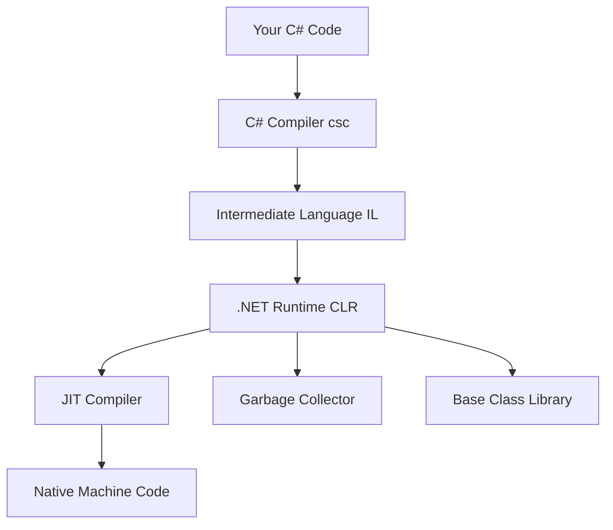

# Module 01: C# Fundamentals - Introduction

## 📘 Welcome to C# Programming

Welcome to the first module of your journey to becoming an elite .NET developer. In this module, you'll master the fundamentals of C#, Microsoft's powerful, type-safe, object-oriented programming language that powers millions of applications worldwide.

## 🎯 Module Objectives

By the end of this module, you will:

- ✅ Understand the C# type system and memory management
- ✅ Write type-safe code using value types and reference types
- ✅ Master control flow structures (if, switch, loops)
- ✅ Create and use methods with various parameter types
- ✅ Implement comprehensive error handling with exceptions
- ✅ Apply C# 14 features and modern idioms
- ✅ Understand memory allocation (stack vs heap)
- ✅ Write production-quality code following best practices

## 🗺️ Module Structure

### Lessons
1. **Introduction** (this document) - Overview and setup
2. **Types and Variables** - Value types, reference types, type system
3. **Control Flow** - Conditionals, loops, pattern matching
4. **Methods and Parameters** - Method design, parameters, return values
5. **Error Handling** - Exceptions, try-catch-finally, custom exceptions
6. **Best Practices** - Code quality, naming conventions, documentation

### Time Commitment
- **Estimated Time**: 1-2 weeks
- **Lessons**: 6-8 hours
- **Exercises**: 10-15 hours
- **Projects**: 5-10 hours

## 🔍 Why C#?

### Industry Adoption
C# is one of the most popular programming languages globally, consistently ranking in the **top 5** on TIOBE and Stack Overflow surveys. It's used by:

- **Microsoft** - Windows, Azure, Office 365
- **Stack Overflow** - Entire platform built on ASP.NET
- **UPS** - Logistics and tracking systems
- **GE Aviation** - Flight management systems
- **Siemens** - Industrial automation

### Key Strengths

#### 1. **Type Safety**
C# is statically typed, meaning type errors are caught at compile-time rather than runtime:

```csharp
string name = "John";
name = 42;  // ❌ Compile error: Cannot implicitly convert type 'int' to 'string'
```

**Why it matters**: Type safety prevents entire classes of bugs before your code runs, saving hours of debugging in production.

#### 2. **Performance**
With .NET 10, C# achieves performance comparable to C++ in many scenarios:

- **Native AOT** compilation for near-instant startup
- **Span\<T\>** and **Memory\<T\>** for zero-allocation code
- **JIT optimization** that adapts to your application's runtime behavior

#### 3. **Modern Language Features**
C# 14 includes cutting-edge features:

- **Field-backed properties** for cleaner code
- **Extension blocks** for static extension methods
- **Partial constructors** for better code organization
- **params collections** for improved performance

#### 4. **Rich Ecosystem**
- **1 million+ NuGet packages** available
- **Enterprise-ready frameworks** (ASP.NET Core, Entity Framework Core)
- **First-class Azure integration**
- **Cross-platform** development (Windows, Linux, macOS)

## 🏗️ C# and .NET Architecture

### The Relationship



**Key Concepts**:

1. **C# Language**: The syntax and features you write code in
2. **Compiler**: Translates C# to Intermediate Language (IL)
3. **Runtime (CLR)**: Executes IL code, manages memory, provides services
4. **Base Class Library**: Pre-built classes (String, List, DateTime, etc.)

### How Code Executes

```csharp
// 1. You write C# code
public class Program
{
    public static void Main()
    {
        Console.WriteLine("Hello, World!");
    }
}

// 2. Compiler converts to IL (Intermediate Language)
// IL_0000: ldstr "Hello, World!"
// IL_0005: call void [System.Console]::WriteLine(string)
// IL_000a: ret

// 3. At runtime, JIT converts IL to native machine code (x86, x64, ARM)
// 4. CPU executes native machine code
```

**Why IL?**
- **Cross-platform**: Same IL runs on Windows, Linux, macOS, ARM
- **Security**: IL can be verified for type safety
- **Optimization**: JIT can optimize based on actual runtime conditions

## 💾 Memory Management Fundamentals

### Stack vs Heap

Understanding memory is crucial for writing efficient C# code:

```csharp
public void Example()
{
    // Stack allocation (fast, automatic cleanup)
    int age = 30;                    // Value type on stack
    DateTime today = DateTime.Now;   // Value type (struct) on stack

    // Heap allocation (slower, garbage collected)
    string name = "John";            // Reference type on heap
    Person person = new Person();    // Reference type on heap

    // What actually happens:
    // Stack: [age: 30] [today: {...}] [name: 0x12345] [person: 0x67890]
    //                                      ↓               ↓
    // Heap:                           ["John"]         [Person object]
}
```

### The Stack
- **Fast allocation/deallocation** (just move a pointer)
- **Automatic cleanup** when method exits
- **Limited size** (~1MB on Windows)
- **Stores**: Local variables, method parameters, return addresses

### The Heap
- **Slower allocation** (must find free space)
- **Garbage collected** (automatic memory management)
- **Large size** (GBs of RAM)
- **Stores**: Objects, arrays, strings

### Garbage Collection

C# uses automatic garbage collection:

```csharp
public void CreateObjects()
{
    // Allocate 1000 objects
    for (int i = 0; i < 1000; i++)
    {
        var obj = new LargeObject();  // Heap allocation
        // obj goes out of scope immediately
    }

    // At some point, GC will:
    // 1. Pause your application
    // 2. Find unreachable objects
    // 3. Reclaim memory
    // 4. Resume your application
} // All 1000 objects are now eligible for collection

// ⚠️ Performance Implication:
// Creating many short-lived objects causes frequent GC pauses
// Solution: Use object pooling or value types (covered in Module 05)
```

**GC Generations**:
- **Gen 0**: Short-lived objects (collected frequently)
- **Gen 1**: Medium-lived objects (survived one collection)
- **Gen 2**: Long-lived objects (collected rarely)

## 🔧 Setting Up Your Environment

### 1. Install .NET 10 SDK

**Windows:**
```powershell
# Using winget
winget install Microsoft.DotNet.SDK.10

# Verify installation
dotnet --version
# Output: 10.0.0 or higher
```

**macOS:**
```bash
# Using Homebrew
brew install --cask dotnet-sdk

# Verify installation
dotnet --version
```

**Linux (Ubuntu):**
```bash
# Add Microsoft repository
wget https://packages.microsoft.com/config/ubuntu/22.04/packages-microsoft-prod.deb -O packages-microsoft-prod.deb
sudo dpkg -i packages-microsoft-prod.deb

# Install SDK
sudo apt-get update
sudo apt-get install -y dotnet-sdk-10.0

# Verify installation
dotnet --version
```

### 2. Choose Your IDE

#### Visual Studio 2025 (Windows/Mac)
**Best for**: Full-featured development, debugging, profiling

**Pros**:
- Powerful debugger with hot reload
- Built-in profiler and diagnostic tools
- IntelliSense and code navigation
- Visual designers for UI

**Cons**:
- Large installation size (~10GB)
- Windows/Mac only

#### Visual Studio Code (All Platforms)
**Best for**: Lightweight development, cross-platform

**Required Extensions**:
- **C# Dev Kit** (by Microsoft)
- **C#** (powered by OmniSharp)
- **.NET Install Tool**

**Pros**:
- Lightweight (~200MB)
- Cross-platform
- Extensive extension ecosystem
- Fast startup

**Cons**:
- Less powerful debugging than Visual Studio
- Requires extension setup

#### JetBrains Rider (All Platforms)
**Best for**: Professional development, refactoring

**Pros**:
- Excellent refactoring tools
- Fast navigation and search
- Built-in decompiler
- Great performance

**Cons**:
- Paid license (free for students/open-source)

### 3. Create Your First Project

```bash
# Create a console application
dotnet new console -n MyFirstApp -o MyFirstApp

# Navigate to project directory
cd MyFirstApp

# Run the application
dotnet run

# Output: Hello, World!
```

**Project Structure**:
```
MyFirstApp/
├── MyFirstApp.csproj    # Project file (dependencies, target framework)
├── Program.cs           # Your code
└── obj/                 # Build output (generated)
```

**MyFirstApp.csproj**:
```xml
<Project Sdk="Microsoft.NET.Sdk">
  <PropertyGroup>
    <!-- Target .NET 10 -->
    <TargetFramework>net10.0</TargetFramework>

    <!-- Enable nullable reference types (best practice) -->
    <Nullable>enable</Nullable>

    <!-- Output type: Exe (executable) -->
    <OutputType>Exe</OutputType>

    <!-- Language version: Use latest (C# 14) -->
    <LangVersion>latest</LangVersion>
  </PropertyGroup>
</Project>
```

**Program.cs** (C# 14 style):
```csharp
// Top-level statements (no Main method needed)
Console.WriteLine("Hello, World!");

// Equivalent to:
/*
class Program
{
    static void Main(string[] args)
    {
        Console.WriteLine("Hello, World!");
    }
}
*/
```

## 📖 Code Style and Conventions

Throughout this tutorial, we follow Microsoft's official [C# Coding Conventions](https://learn.microsoft.com/en-us/dotnet/csharp/fundamentals/coding-style/coding-conventions):

### Naming Conventions

```csharp
// PascalCase for public members
public class CustomerService { }
public void ProcessOrder() { }
public string FirstName { get; set; }

// camelCase for private fields and local variables
private string _connectionString;
private int _retryCount;
int localVariable = 42;

// UPPER_CASE for constants
public const int MAX_RETRY_COUNT = 3;

// Interfaces start with 'I'
public interface ICustomerRepository { }

// Async methods end with 'Async'
public async Task<Customer> GetCustomerAsync(int id) { }
```

### Code Organization

```csharp
// 1. Using directives (sorted alphabetically)
using System;
using System.Collections.Generic;
using System.Linq;

// 2. Namespace
namespace MyCompany.MyProduct.Orders;

// 3. Class/interface/enum
public class OrderService
{
    // 4. Constants
    private const int MaxRetries = 3;

    // 5. Fields
    private readonly ILogger<OrderService> _logger;
    private readonly IOrderRepository _repository;

    // 6. Constructor(s)
    public OrderService(ILogger<OrderService> logger, IOrderRepository repository)
    {
        _logger = logger;
        _repository = repository;
    }

    // 7. Properties
    public int ProcessedOrderCount { get; private set; }

    // 8. Public methods
    public async Task<Order> ProcessOrderAsync(int orderId)
    {
        // Implementation
    }

    // 9. Private methods
    private void ValidateOrder(Order order)
    {
        // Implementation
    }
}
```

## 🎓 Learning Approach

### How to Use This Module

1. **Read Lessons Sequentially**: Each lesson builds on previous knowledge
2. **Type Code Yourself**: Don't copy-paste; typing builds muscle memory
3. **Experiment**: Modify examples to see what happens
4. **Complete Exercises**: Practice is essential for mastery
5. **Build the Project**: Apply concepts in a real-world scenario
6. **Review Solutions**: Compare your approach with provided solutions

### Getting Help

When stuck:
1. **Read error messages carefully**: They often tell you exactly what's wrong
2. **Use the debugger**: Step through code line by line
3. **Consult official docs**: [Microsoft C# Documentation](https://learn.microsoft.com/en-us/dotnet/csharp/)
4. **Search Stack Overflow**: Someone has probably had the same issue
5. **Review the hints.md** file in each exercise directory

## 📚 Additional Resources

### Official Documentation
- [C# Language Reference](https://learn.microsoft.com/en-us/dotnet/csharp/language-reference/)
- [C# Programming Guide](https://learn.microsoft.com/en-us/dotnet/csharp/programming-guide/)
- [.NET API Browser](https://learn.microsoft.com/en-us/dotnet/api/)

### Books
- *C# 12 in a Nutshell* by Joseph Albahari
- *Effective C#* by Bill Wagner
- *C# in Depth* by Jon Skeet

### Video Courses
- [Microsoft Learn C# Path](https://learn.microsoft.com/en-us/training/paths/get-started-c-sharp-part-1/)
- [Pluralsight C# Fundamentals](https://www.pluralsight.com/courses/csharp-fundamentals-dev)

## ✅ Prerequisites Check

Before proceeding, ensure you have:

- [ ] .NET 10 SDK installed (`dotnet --version`)
- [ ] IDE installed and configured (VS 2025, VS Code, or Rider)
- [ ] Created and run your first console application
- [ ] Understood the stack vs heap concept
- [ ] Familiar with the module structure

## ⏭️ Next Steps

Ready to dive in? Proceed to:
- **[Lesson 02: Types and Variables](02-types-and-variables.md)**

You'll learn about:
- Value types vs reference types in depth
- Type conversions and casting
- Nullable types and null handling
- String manipulation and memory considerations
- Modern C# type features (records, tuples)

---

**Questions?** Review this introduction or consult the [official C# docs](https://learn.microsoft.com/en-us/dotnet/csharp/).

*"The only way to learn a new programming language is by writing programs in it." - Dennis Ritchie*
