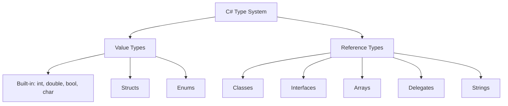

# Module 01: C# Fundamentals - Types and Variables

## 📘 Understanding the C# Type System

The C# type system is **statically typed** and **strongly typed**, meaning every variable must have a type known at compile-time, and type conversions must be explicit or implicitly safe.

## 🎯 Learning Objectives

- Master value types vs reference types
- Understand memory allocation for different types
- Use type conversions safely
- Handle null values with nullable types and null-coalescing operators
- Work with strings efficiently
- Leverage modern C# type features (tuples, records, pattern matching)

## 📊 Type System Overview



## 🔢 Value Types

### Characteristics
- **Stored on stack** (usually)
- **Contains actual data** (not a reference)
- **Copied when assigned** (pass-by-value)
- **Cannot be null** (without nullable wrapper)

### Built-in Value Types

```csharp
// Integer types
sbyte  s8  = -128;          // 8-bit signed   (-128 to 127)
byte   u8  = 255;           // 8-bit unsigned (0 to 255)
short  s16 = -32_768;       // 16-bit signed  (-32,768 to 32,767)
ushort u16 = 65_535;        // 16-bit unsigned (0 to 65,535)
int    s32 = -2_147_483_648;// 32-bit signed  (most common)
uint   u32 = 4_294_967_295; // 32-bit unsigned
long   s64 = -9_223_372_036_854_775_808L;  // 64-bit signed
ulong  u64 = 18_446_744_073_709_551_615UL; // 64-bit unsigned

// Floating-point types
float  f32 = 3.14159f;      // 32-bit, 6-9 digits precision
double f64 = 3.14159265359; // 64-bit, 15-17 digits precision (default)
decimal dec = 79228162514264337593543950335m; // 128-bit, 28-29 digits (financial)

// Other value types
bool    flag = true;        // true or false
char    letter = 'A';       // Single Unicode character (UTF-16)
```

### Why Multiple Integer Types?

**Memory Efficiency Example:**
```csharp
// Storing age: range 0-120
public class Person
{
    // ❌ Bad: Wastes memory
    public long Age { get; set; }  // 8 bytes for values up to 120

    // ✅ Good: Appropriate size
    public byte Age { get; set; }  // 1 byte, perfect for 0-255 range
}

// For 1 million Person objects:
// long:  8 MB for Age field
// byte:  1 MB for Age field
// Savings: 7 MB (87.5% reduction)
```

### Floating-Point vs Decimal

```csharp
// Float/Double: Fast but imprecise
double price1 = 0.1;
double price2 = 0.2;
double total = price1 + price2;
Console.WriteLine(total);  // Output: 0.30000000000000004 ⚠️

// Why? Binary floating-point can't represent 0.1 exactly
// 0.1 in binary ≈ 0.0001100110011001100... (repeating)

// Decimal: Slower but precise (use for money)
decimal price1m = 0.1m;
decimal price2m = 0.2m;
decimal totalm = price1m + price2m;
Console.WriteLine(totalm);  // Output: 0.3 ✅

// Performance comparison (BenchmarkDotNet results):
// Operation      | double    | decimal
// ---------------|-----------|----------
// Addition       | 0.3 ns    | 5.2 ns
// Multiplication | 0.3 ns    | 8.7 ns
// Division       | 0.9 ns    | 44.3 ns

// Rule of thumb:
// - Use double for scientific calculations (physics, graphics)
// - Use decimal for financial calculations (money, accounting)
// - Use float only when space is critical (large arrays, GPU data)
```

### Number Formatting Features (C# 7+)

```csharp
// Digit separators (readability)
int million = 1_000_000;
long creditCard = 1234_5678_9012_3456L;
binary = 0b1010_1111_0000_1100;  // Binary literal

// Binary and hexadecimal literals
int binary = 0b1010_1111;        // 175 in decimal
int hex = 0xFF;                  // 255 in decimal
```

### Structs: Custom Value Types

```csharp
// Define a struct (value type)
public struct Point
{
    public int X { get; set; }
    public int Y { get; set; }

    public Point(int x, int y)
    {
        X = x;
        Y = y;
    }

    public double DistanceFromOrigin()
    {
        return Math.Sqrt(X * X + Y * Y);
    }
}

// Usage
Point p1 = new Point(10, 20);
Point p2 = p1;  // COPY - p2 is a separate instance

p2.X = 30;      // Only p2 changes
Console.WriteLine(p1.X);  // Output: 10
Console.WriteLine(p2.X);  // Output: 30

// Memory layout (simplified):
// Stack: [p1: {X=10, Y=20}] [p2: {X=30, Y=20}]
```

**When to Use Structs:**
✅ Small data structures (< 16 bytes recommended)
✅ Immutable types (don't change after creation)
✅ Values that behave like primitives
✅ High-performance scenarios (avoid heap allocation)

❌ Large data structures (expensive to copy)
❌ Mutable types that change frequently
❌ Types that need inheritance (structs don't support it)

### Enums: Named Constants

```csharp
// Define an enum
public enum OrderStatus
{
    Pending = 0,      // Explicit values (optional)
    Processing = 1,
    Shipped = 2,
    Delivered = 3,
    Cancelled = 4
}

// Usage
OrderStatus status = OrderStatus.Pending;

// Switch expression (C# 8+)
string message = status switch
{
    OrderStatus.Pending => "Your order is pending",
    OrderStatus.Processing => "Your order is being processed",
    OrderStatus.Shipped => "Your order has been shipped",
    OrderStatus.Delivered => "Your order has been delivered",
    OrderStatus.Cancelled => "Your order was cancelled",
    _ => throw new ArgumentException("Unknown status")
};

// Convert to/from int
int statusCode = (int)status;           // 0
OrderStatus parsed = (OrderStatus)2;    // OrderStatus.Shipped

// Convert to/from string
string statusName = status.ToString();  // "Pending"
OrderStatus fromString = Enum.Parse<OrderStatus>("Shipped");  // OrderStatus.Shipped

// Check if valid
bool isValid = Enum.IsDefined(typeof(OrderStatus), 99);  // false
```

**Flags Enum (Bit Flags):**
```csharp
[Flags]  // Attribute indicates this enum represents bit flags
public enum FilePermissions
{
    None = 0,           // 0000
    Read = 1,           // 0001
    Write = 2,          // 0010
    Execute = 4,        // 0100
    Delete = 8          // 1000
}

// Combine flags with bitwise OR (|)
FilePermissions perms = FilePermissions.Read | FilePermissions.Write;
// perms = 3 (0011 in binary)

// Check for specific permission with bitwise AND (&)
bool canRead = (perms & FilePermissions.Read) == FilePermissions.Read;  // true
bool canExecute = (perms & FilePermissions.Execute) == FilePermissions.Execute;  // false

// Add permission
perms |= FilePermissions.Execute;  // perms = 7 (0111)

// Remove permission
perms &= ~FilePermissions.Write;   // perms = 5 (0101) - Read + Execute

// Why use flags?
// - Memory efficient: Store multiple boolean values in single integer
// - Fast operations: Bitwise operations are extremely fast
// - Clean API: Clear intent in code
```

## 🔗 Reference Types

### Characteristics
- **Stored on heap**
- **Variable contains reference (memory address)**
- **Reference is copied when assigned** (not the object)
- **Can be null**
- **Garbage collected**

### Classes

```csharp
public class Person
{
    public string FirstName { get; set; }
    public string LastName { get; set; }
    public int Age { get; set; }

    public Person(string firstName, string lastName, int age)
    {
        FirstName = firstName;
        LastName = lastName;
        Age = age;
    }

    public string GetFullName() => $"{FirstName} {LastName}";
}

// Usage - Reference semantics
Person person1 = new Person("John", "Doe", 30);
Person person2 = person1;  // REFERENCE COPY - both point to same object

person2.Age = 31;          // Modifies the shared object
Console.WriteLine(person1.Age);  // Output: 31 (same object!)

// Memory layout:
// Stack:  [person1: 0x12345] [person2: 0x12345]  (both point to same address)
//                   ↓             ↓
// Heap:        [Person {FirstName="John", LastName="Doe", Age=31}]
```

### Null and Null Reference Types (C# 8+)

**The Billion Dollar Mistake**: Tony Hoare, who invented null references, called it his "billion dollar mistake" due to countless NullReferenceException errors.

**C# 8+ Solution: Nullable Reference Types**

```csharp
// Enable in .csproj
// <Nullable>enable</Nullable>

// Non-nullable by default (compiler warning if might be null)
string name = GetName();        // Warning if GetName() might return null
Console.WriteLine(name.Length); // Safe - name cannot be null

// Explicitly nullable (can be null)
string? optionalName = GetOptionalName();  // Can return null
Console.WriteLine(optionalName.Length);     // ⚠️ Warning: possible null reference

// Safe patterns:

// 1. Null check
if (optionalName != null)
{
    Console.WriteLine(optionalName.Length);  // ✅ Safe - compiler knows it's not null
}

// 2. Null-conditional operator
Console.WriteLine(optionalName?.Length);  // Returns null if optionalName is null
// Output: null or the length

// 3. Null-coalescing operator
string safeName = optionalName ?? "Unknown";
// If optionalName is null, use "Unknown"

// 4. Null-coalescing assignment (C# 8+)
optionalName ??= "Default";
// If optionalName is null, assign "Default"
// Equivalent to: if (optionalName == null) optionalName = "Default";

// 5. Throw expression
string requiredName = optionalName ?? throw new ArgumentNullException(nameof(optionalName));
```

**Real-World Example:**
```csharp
public class OrderService
{
    private readonly ILogger<OrderService> _logger;

    public OrderService(ILogger<OrderService> logger)
    {
        // ArgumentNullException.ThrowIfNull is a .NET 6+ helper
        ArgumentNullException.ThrowIfNull(logger);
        _logger = logger;
    }

    public Order? FindOrder(int orderId)
    {
        // ? indicates method might return null
        var order = _database.Orders.FirstOrDefault(o => o.Id == orderId);

        if (order == null)
        {
            _logger.LogWarning("Order {OrderId} not found", orderId);
        }

        return order;  // Can return null
    }

    public void ProcessOrder(int orderId)
    {
        var order = FindOrder(orderId);

        // Must check for null before using
        if (order != null)
        {
            order.Status = OrderStatus.Processing;
            _database.SaveChanges();
        }

        // Alternative: Use pattern matching (C# 9+)
        if (order is not null)
        {
            // Process order
        }
    }
}
```

### Strings: Special Reference Type

Strings are **reference types** but behave like **value types** due to **immutability**.

```csharp
// String immutability
string original = "Hello";
string modified = original.ToUpper();  // Creates NEW string
Console.WriteLine(original);  // Output: "Hello" (unchanged)
Console.WriteLine(modified);  // Output: "HELLO"

// Why immutable?
// 1. Thread safety (multiple threads can share strings safely)
// 2. String interning (identical literals share memory)
// 3. Security (strings used in authentication can't be modified)
// 4. Hash code stability (used as dictionary keys)

// String interning
string s1 = "hello";
string s2 = "hello";
Console.WriteLine(ReferenceEquals(s1, s2));  // Output: true
// Both point to the SAME object in memory (optimization)

// But concatenation creates new strings
string s3 = "hel" + "lo";
Console.WriteLine(ReferenceEquals(s1, s3));  // Output: true (compiler optimizes)

string s4 = "hel";
s4 += "lo";  // Runtime concatenation
Console.WriteLine(ReferenceEquals(s1, s4));  // Output: false (different objects)
```

### String Performance

```csharp
// ❌ BAD: String concatenation in loop
string result = "";
for (int i = 0; i < 1000; i++)
{
    result += i.ToString();  // Creates 1000 new string objects!
}
// Each += creates a NEW string, copies old content + new content
// Time complexity: O(n²)
// Memory: 1000 temporary strings (garbage collected later)

// ✅ GOOD: StringBuilder for multiple concatenations
var sb = new StringBuilder();
for (int i = 0; i < 1000; i++)
{
    sb.Append(i);  // Modifies internal buffer (no new objects)
}
string result = sb.ToString();  // Single final string
// Time complexity: O(n)
// Memory: One StringBuilder, one final string

// Benchmark results (1000 iterations):
// String concatenation: ~5,000 μs
// StringBuilder:        ~    50 μs
// 100x faster!
```

**Modern String Features:**

```csharp
// String interpolation (C# 6+)
string name = "John";
int age = 30;
string message = $"Hello, {name}! You are {age} years old.";
// Output: "Hello, John! You are 30 years old."

// Format specifiers
decimal price = 123.456m;
Console.WriteLine($"Price: {price:C}");        // Currency: $123.46
Console.WriteLine($"Price: {price:F2}");       // Fixed-point: 123.46
Console.WriteLine($"Price: {price:N2}");       // Number: 123.46

DateTime now = DateTime.Now;
Console.WriteLine($"Date: {now:yyyy-MM-dd}");  // Date: 2025-11-12
Console.WriteLine($"Time: {now:HH:mm:ss}");    // Time: 14:30:45

// Verbatim strings (ignore escape sequences)
string path = @"C:\Users\John\Documents\file.txt";
// No need to escape backslashes

// Raw string literals (C# 11+) - for multi-line with exact formatting
string json = """
{
    "name": "John",
    "age": 30
}
""";

// UTF-8 string literals (C# 11+)
ReadOnlySpan<byte> utf8 = "Hello"u8;
// Directly creates UTF-8 byte sequence (no conversion)
```

## 🔄 Type Conversions

### Implicit Conversion (Safe)

```csharp
// Widening conversions (no data loss)
int i = 123;
long l = i;        // ✅ int to long (always safe)
float f = i;       // ✅ int to float
double d = f;      // ✅ float to double

// Why safe?
// int:    32 bits, range ±2 billion
// long:   64 bits, range ±9 quintillion
// No data can be lost
```

### Explicit Conversion (Casting - May Lose Data)

```csharp
// Narrowing conversions (potential data loss)
double d = 123.456;
int i = (int)d;              // ⚠️ i = 123 (loses decimal part)

long l = 3_000_000_000;
int i2 = (int)l;             // ⚠️ Overflow (wraps around)
// int max: 2,147,483,647
// l = 3,000,000,000 (exceeds int.MaxValue)
// Result: Unpredictable (depends on overflow behavior)

// Safe casting with overflow checking
checked
{
    long l = 3_000_000_000;
    int i = (int)l;  // Throws OverflowException
}

// Or check before casting
if (l >= int.MinValue && l <= int.MaxValue)
{
    int i = (int)l;  // Safe
}
```

### Type Conversion Methods

```csharp
// Convert class (throws exception on failure)
string numberStr = "123";
int num = Convert.ToInt32(numberStr);  // 123

try
{
    int invalid = Convert.ToInt32("abc");
}
catch (FormatException ex)
{
    Console.WriteLine("Invalid format");
}

// Parse methods (throws exception on failure)
int num2 = int.Parse("456");
double d = double.Parse("123.45");

// TryParse (recommended - no exceptions)
if (int.TryParse("789", out int result))
{
    Console.WriteLine($"Success: {result}");
}
else
{
    Console.WriteLine("Failed to parse");
}

// Benefits of TryParse:
// 1. No exception overhead (exceptions are expensive)
// 2. Cleaner control flow
// 3. Better performance in failure cases
```

### Pattern Matching Conversions (C# 7+)

```csharp
object obj = "Hello";

// Type pattern
if (obj is string str)
{
    // str is automatically string type here
    Console.WriteLine(str.ToUpper());
}

// Switch expression with type patterns (C# 8+)
string description = obj switch
{
    string s => $"String of length {s.Length}",
    int i => $"Integer: {i}",
    double d => $"Double: {d:F2}",
    null => "Null value",
    _ => "Unknown type"
};
```

## 🎯 Nullable Value Types

Value types cannot be null by default. Use `Nullable<T>` or `T?` to allow null:

```csharp
// These are equivalent:
Nullable<int> nullableInt1 = null;
int? nullableInt2 = null;

// Usage
int? age = null;

// Check for value
if (age.HasValue)
{
    Console.WriteLine($"Age is {age.Value}");
}
else
{
    Console.WriteLine("Age is not set");
}

// Null-coalescing operator
int actualAge = age ?? 0;  // Use 0 if null
Console.WriteLine(actualAge);  // Output: 0

// Real-world example: Optional parameters from database
public class User
{
    public int Id { get; set; }
    public string Name { get; set; }
    public DateTime? LastLogin { get; set; }  // Nullable - user might never log in
    public int? Age { get; set; }             // Nullable - user might not provide age

    public string GetLastLoginDisplay()
    {
        return LastLogin?.ToString("yyyy-MM-dd") ?? "Never logged in";
    }
}
```

## 🆕 Modern Type Features

### Tuples (C# 7+)

```csharp
// Return multiple values from method
public (int Min, int Max) GetRange(int[] numbers)
{
    return (numbers.Min(), numbers.Max());
}

// Usage
var result = GetRange(new[] { 1, 5, 3, 9, 2 });
Console.WriteLine($"Min: {result.Min}, Max: {result.Max}");
// Output: Min: 1, Max: 9

// Deconstruction
(int min, int max) = GetRange(new[] { 1, 5, 3, 9, 2 });
Console.WriteLine($"Min: {min}, Max: {max}");

// Tuple as temporary data structure
var person = (Name: "John", Age: 30);
Console.WriteLine($"{person.Name} is {person.Age} years old");
```

### Records (C# 9+)

Records are **reference types** optimized for **immutable data**.

```csharp
// Define a record
public record Person(string FirstName, string LastName, int Age);

// Usage
var person1 = new Person("John", "Doe", 30);

// Immutable - cannot change properties (with default)
// person1.Age = 31;  // ❌ Compile error (if properties are init-only)

// Use 'with' expression to create modified copy
var person2 = person1 with { Age = 31 };
Console.WriteLine(person1.Age);  // Output: 30
Console.WriteLine(person2.Age);  // Output: 31

// Value-based equality (compares content, not reference)
var person3 = new Person("John", "Doe", 30);
Console.WriteLine(person1 == person3);  // Output: true (same content)
// With classes, this would be false (different references)

// ToString() automatically generated
Console.WriteLine(person1);
// Output: Person { FirstName = John, LastName = Doe, Age = 30 }

// Deconstruction
var (firstName, lastName, age) = person1;
Console.WriteLine($"{firstName} {lastName} is {age} years old");
```

**When to Use Records:**
✅ DTOs (Data Transfer Objects)
✅ Immutable configuration
✅ Value objects in Domain-Driven Design
✅ API models

### Record Structs (C# 10+)

```csharp
// Record struct (value type + record benefits)
public readonly record struct Point(int X, int Y);

// Benefits:
// - Value semantics (stack allocated)
// - Immutable (readonly)
// - Value-based equality
// - Deconstruction
```

## 📝 Variable Declaration

```csharp
// Explicit type
int age = 30;
string name = "John";

// Implicit type (var keyword)
var age2 = 30;        // Compiler infers int
var name2 = "John";   // Compiler infers string

// var requires initialization
// var x;  // ❌ Compile error

// When to use var:
// ✅ When type is obvious from right side
var customer = new Customer();
var numbers = new List<int>();

// ❌ When type is not obvious
var result = GetResult();  // What type is result?

// Better:
Customer result = GetResult();
```

### Target-Typed New (C# 9+)

```csharp
// Traditional
List<int> numbers = new List<int>();

// Target-typed new (C# 9+)
List<int> numbers = new();  // Type inferred from left side

// Works with parameters
void ProcessOrders(List<Order> orders) { }
ProcessOrders(new());  // Creates new List<Order>
```

## 💾 Memory and Performance Considerations

### Boxing and Unboxing

```csharp
// Boxing: Value type → Reference type (allocates on heap)
int i = 123;
object obj = i;  // ⚠️ Boxing - allocates heap memory, creates object

// Unboxing: Reference type → Value type (extracts value)
int j = (int)obj;  // ⚠️ Unboxing - type check + copy

// Why expensive?
// 1. Heap allocation (slower than stack)
// 2. Garbage collection pressure
// 3. Type checking overhead

// Example: Performance impact
// ❌ BAD
var list = new ArrayList();  // Stores object (boxes value types)
for (int i = 0; i < 1000; i++)
{
    list.Add(i);  // 1000 boxing operations!
}

// ✅ GOOD
var list = new List<int>();  // Generic - no boxing
for (int i = 0; i < 1000; i++)
{
    list.Add(i);  // No boxing - direct storage
}

// Benchmark:
// ArrayList (boxing):  ~10,000 ns, 16 KB allocated
// List<int>:           ~    500 ns,  4 KB allocated
// 20x faster, 4x less memory!
```

## ✅ Best Practices Summary

1. **Use appropriate types**: Don't use `long` for age (0-120)
2. **Use `decimal` for money**: Never `float` or `double` for financial calculations
3. **Enable nullable reference types**: `<Nullable>enable</Nullable>` in .csproj
4. **Use `TryParse` over `Parse`**: Avoid exceptions for control flow
5. **Use `StringBuilder` for multiple concatenations**: Not string +=
6. **Prefer `List<T>` over `ArrayList`**: Avoid boxing
7. **Use records for immutable data**: DTOs, value objects
8. **Use `var` when type is obvious**: Improves readability
9. **Use `null-coalescing` operators**: Clean null handling

## ⏭️ Next Lesson

Proceed to **[Lesson 03: Control Flow](03-control-flow.md)** to learn about:
- Conditional statements (if, switch)
- Pattern matching
- Loops (for, foreach, while)
- Jump statements (break, continue, return)

## 📚 Additional Resources

- [C# Type System](https://learn.microsoft.com/en-us/dotnet/csharp/fundamentals/types/)
- [Value Types](https://learn.microsoft.com/en-us/dotnet/csharp/language-reference/builtin-types/value-types)
- [Reference Types](https://learn.microsoft.com/en-us/dotnet/csharp/language-reference/keywords/reference-types)
- [Nullable Types](https://learn.microsoft.com/en-us/dotnet/csharp/nullable-references)

---

*"Premature optimization is the root of all evil, but knowing your types is just good practice." - Adapted from Donald Knuth*
