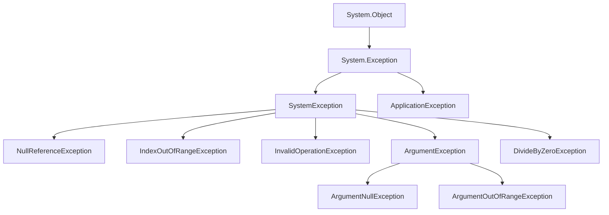

# Module 01: C# Fundamentals - Error Handling

## 📘 Exception Handling: Managing the Unexpected

Robust error handling is what separates toy code from production-grade software. Learn to handle errors gracefully, provide meaningful feedback, and maintain application stability.

## 🎯 Learning Objectives

- Understand exceptions and the exception hierarchy
- Use try-catch-finally blocks effectively
- Create custom exceptions
- Apply exception handling best practices
- Understand when to throw vs catch exceptions
- Use modern C# exception features

## 🚨 What Are Exceptions?

**Exceptions** are objects that represent errors or unexpected conditions that occur during program execution.

```csharp
// This code throws an exception
int[] numbers = { 1, 2, 3 };
int value = numbers[10];  // ❌ IndexOutOfRangeException (index 10 doesn't exist)

// When exception is thrown:
// 1. Normal execution stops immediately
// 2. Runtime searches for exception handler (catch block)
// 3. If no handler found, program terminates
```

### Exception vs Error Code

```csharp
// Old style: Error codes (C, pre-exception languages)
int result = DoSomething();
if (result == ERROR_CODE)
{
    // Handle error
}

// Modern: Exceptions (C#, Java, Python, etc.)
try
{
    DoSomething();  // Throws exception on error
}
catch (Exception ex)
{
    // Handle exception
}

// Benefits of exceptions:
// 1. Can't ignore them (error codes can be ignored)
// 2. Separate error handling from business logic
// 3. Propagate up the call stack automatically
// 4. Rich error information (stack trace, message, inner exceptions)
```

## 🏗️ Exception Hierarchy



**Common Exceptions:**

| Exception | When Thrown | Example |
|-----------|-------------|---------|
| `NullReferenceException` | Accessing member of null object | `string.Length` when string is null |
| `IndexOutOfRangeException` | Array index out of bounds | `array[100]` when array has 10 elements |
| `ArgumentNullException` | Null argument passed to method | Method requires non-null parameter |
| `ArgumentException` | Invalid argument value | Negative value when positive required |
| `InvalidOperationException` | Method called at wrong time | Calling `Next()` on closed database reader |
| `DivideByZeroException` | Division by zero | `10 / 0` |
| `FileNotFoundException` | File doesn't exist | Opening non-existent file |
| `UnauthorizedAccessException` | Insufficient permissions | Accessing protected resource |

## 🛡️ Try-Catch-Finally

### Basic Try-Catch

```csharp
try
{
    // Code that might throw an exception
    int[] numbers = { 1, 2, 3 };
    int value = numbers[10];  // Throws IndexOutOfRangeException
    Console.WriteLine(value);  // Never executes
}
catch (IndexOutOfRangeException ex)
{
    // Handle the exception
    Console.WriteLine($"Error: Array index out of range");
    Console.WriteLine($"Message: {ex.Message}");
    Console.WriteLine($"Stack trace: {ex.StackTrace}");
}

// Program continues here (doesn't crash)
Console.WriteLine("Program continues...");
```

### Multiple Catch Blocks

```csharp
try
{
    string input = Console.ReadLine();
    int number = int.Parse(input);  // May throw FormatException
    int result = 100 / number;      // May throw DivideByZeroException
    Console.WriteLine($"Result: {result}");
}
catch (FormatException ex)
{
    Console.WriteLine("Invalid input format. Please enter a number.");
}
catch (DivideByZeroException ex)
{
    Console.WriteLine("Cannot divide by zero.");
}
catch (Exception ex)  // Catch-all (must be last)
{
    Console.WriteLine($"Unexpected error: {ex.Message}");
}

// Order matters!
// - Specific exceptions first
// - General exceptions last
// - Most derived types before base types
```

### Finally Block

```csharp
FileStream? file = null;
try
{
    file = File.OpenRead("data.txt");
    // Process file
}
catch (FileNotFoundException ex)
{
    Console.WriteLine("File not found");
}
finally
{
    // ALWAYS executes (even if exception thrown or return called)
    file?.Dispose();  // Clean up resources
    Console.WriteLine("Cleanup completed");
}

// Use cases for finally:
// 1. Close file handles
// 2. Release database connections
// 3. Release locks
// 4. Log completion
```

### Using Statement (Preferred for Resources)

```csharp
// Traditional try-finally
FileStream? file = null;
try
{
    file = File.OpenRead("data.txt");
    // Use file
}
finally
{
    file?.Dispose();
}

// Modern: using statement (automatic Dispose call)
using (FileStream file = File.OpenRead("data.txt"))
{
    // Use file
}  // Dispose() automatically called here

// C# 8+: using declaration (no braces needed)
using FileStream file = File.OpenRead("data.txt");
// Use file
// Dispose() automatically called at end of scope
```

## 🎯 Exception Filters (C# 6+)

```csharp
try
{
    ProcessData();
}
catch (HttpRequestException ex) when (ex.StatusCode == HttpStatusCode.NotFound)
{
    Console.WriteLine("Resource not found");
}
catch (HttpRequestException ex) when (ex.StatusCode == HttpStatusCode.Unauthorized)
{
    Console.WriteLine("Unauthorized access");
}
catch (HttpRequestException ex)
{
    Console.WriteLine($"HTTP error: {ex.StatusCode}");
}

// Benefits:
// 1. More granular exception handling
// 2. Avoids re-throwing (better performance)
// 3. Clearer intent
```

**With Logging:**
```csharp
try
{
    RiskyOperation();
}
catch (Exception ex) when (LogException(ex))
{
    // This catch block never executes (LogException returns false)
    // But exception is logged before propagating up
}

bool LogException(Exception ex)
{
    _logger.LogError(ex, "Exception occurred");
    return false;  // Don't catch, let it propagate
}
```

## 🚀 Throwing Exceptions

### Throw Keyword

```csharp
public void Withdraw(decimal amount)
{
    if (amount <= 0)
    {
        throw new ArgumentException("Amount must be positive", nameof(amount));
    }

    if (amount > Balance)
    {
        throw new InvalidOperationException("Insufficient funds");
    }

    Balance -= amount;
}

// Usage
try
{
    account.Withdraw(-100);  // Throws ArgumentException
}
catch (ArgumentException ex)
{
    Console.WriteLine($"Invalid argument: {ex.Message}");
}
```

### Rethrowing Exceptions

```csharp
try
{
    ProcessData();
}
catch (Exception ex)
{
    // Log the error
    _logger.LogError(ex, "Error processing data");

    // ✅ GOOD: Rethrow (preserves stack trace)
    throw;

    // ❌ BAD: Throws new exception (loses original stack trace)
    // throw ex;
}

// Why difference?
// - throw;     Preserves original stack trace
// - throw ex;  Creates new stack trace starting here
```

### Throw Expressions (C# 7+)

```csharp
// Throw in expression context
public Customer GetCustomer(int id)
{
    return _customers.FirstOrDefault(c => c.Id == id)
        ?? throw new KeyNotFoundException($"Customer {id} not found");
}

// In null-coalescing
string name = input ?? throw new ArgumentNullException(nameof(input));

// In ternary operator
int value = isValid
    ? computedValue
    : throw new InvalidOperationException("Cannot compute value");

// In expression-bodied member
public string Name
{
    get => _name ?? throw new InvalidOperationException("Name not set");
    set => _name = value ?? throw new ArgumentNullException(nameof(value));
}
```

## 🎨 Custom Exceptions

### Creating Custom Exceptions

```csharp
// Custom exception - inherit from Exception
public class InsufficientFundsException : Exception
{
    public decimal RequestedAmount { get; }
    public decimal AvailableBalance { get; }

    public InsufficientFundsException()
    {
    }

    public InsufficientFundsException(string message)
        : base(message)
    {
    }

    public InsufficientFundsException(string message, Exception innerException)
        : base(message, innerException)
    {
    }

    public InsufficientFundsException(
        string message,
        decimal requestedAmount,
        decimal availableBalance)
        : base(message)
    {
        RequestedAmount = requestedAmount;
        AvailableBalance = availableBalance;
    }
}

// Usage
public void Withdraw(decimal amount)
{
    if (amount > Balance)
    {
        throw new InsufficientFundsException(
            $"Cannot withdraw {amount:C}. Available: {Balance:C}",
            requestedAmount: amount,
            availableBalance: Balance);
    }

    Balance -= amount;
}

// Catching custom exception
try
{
    account.Withdraw(1000);
}
catch (InsufficientFundsException ex)
{
    Console.WriteLine(ex.Message);
    Console.WriteLine($"You tried to withdraw {ex.RequestedAmount:C}");
    Console.WriteLine($"Your balance is {ex.AvailableBalance:C}");
}
```

### When to Create Custom Exceptions

✅ **Create custom exception when:**
- You need to catch this specific error type
- You need to include additional error data
- The error represents a specific domain concept

❌ **Don't create custom exception when:**
- Built-in exception type already exists
- You're never going to catch it specifically
- It doesn't add value over standard exceptions

## 📊 Inner Exceptions

```csharp
// Preserve error context when wrapping exceptions
try
{
    try
    {
        // Low-level operation
        File.ReadAllText("config.json");
    }
    catch (FileNotFoundException ex)
    {
        // Wrap in domain-specific exception
        throw new ConfigurationException(
            "Failed to load configuration",
            innerException: ex);  // Preserve original exception
    }
}
catch (ConfigurationException ex)
{
    Console.WriteLine($"Error: {ex.Message}");
    Console.WriteLine($"Original error: {ex.InnerException?.Message}");

    // Full exception chain
    var current = ex;
    while (current != null)
    {
        Console.WriteLine($"  {current.GetType().Name}: {current.Message}");
        current = current.InnerException;
    }
}

// Output:
// Error: Failed to load configuration
// Original error: Could not find file 'config.json'
//   ConfigurationException: Failed to load configuration
//   FileNotFoundException: Could not find file 'config.json'
```

## ✅ Best Practices

### 1. Catch Specific Exceptions

```csharp
// ❌ BAD: Catch-all exception
try
{
    ProcessData();
}
catch (Exception ex)
{
    Console.WriteLine("Something went wrong");
}

// ✅ GOOD: Catch specific exceptions
try
{
    ProcessData();
}
catch (FileNotFoundException ex)
{
    Console.WriteLine($"File not found: {ex.FileName}");
}
catch (UnauthorizedAccessException ex)
{
    Console.WriteLine("Permission denied");
}
catch (Exception ex)  // Catch-all as last resort
{
    _logger.LogError(ex, "Unexpected error");
    throw;  // Re-throw unexpected exceptions
}
```

### 2. Don't Catch What You Can't Handle

```csharp
// ❌ BAD: Swallowing exceptions
try
{
    SaveToDatabase();
}
catch (Exception ex)
{
    // Do nothing - exception is lost!
}

// ✅ GOOD: Only catch if you can handle
try
{
    SaveToDatabase();
}
catch (DbUpdateConcurrencyException ex)
{
    // Handle specific case (retry, refresh, notify user)
    RetryWithExponentialBackoff();
}
// Let other exceptions propagate up
```

### 3. Use Exceptions for Exceptional Cases

```csharp
// ❌ BAD: Exceptions for control flow
public int GetValue(string key)
{
    try
    {
        return _dictionary[key];
    }
    catch (KeyNotFoundException)
    {
        return 0;  // Using exception for normal case
    }
}

// ✅ GOOD: Check before accessing
public int GetValue(string key)
{
    return _dictionary.TryGetValue(key, out int value) ? value : 0;
}

// Why?
// - Exceptions are EXPENSIVE (~1000x slower than if statement)
// - Stack unwinding, memory allocation
// - Use exceptions only for exceptional situations
```

### 4. Provide Meaningful Messages

```csharp
// ❌ BAD: Generic message
throw new Exception("Error");

// ✅ GOOD: Specific, actionable message
throw new ArgumentException(
    $"Age must be between 0 and 150, but was {age}",
    nameof(age));

// Include:
// 1. What went wrong
// 2. Why it went wrong
// 3. How to fix it (if applicable)
// 4. Relevant values
```

### 5. Clean Up Resources

```csharp
// ✅ GOOD: Using statement for IDisposable
using (var connection = new SqlConnection(connectionString))
{
    connection.Open();
    // Use connection
}  // Automatically disposed even if exception thrown

// For multiple resources
using var file1 = File.OpenRead("file1.txt");
using var file2 = File.OpenRead("file2.txt");
// Use files
// Both automatically disposed
```

### 6. Validate Arguments

```csharp
public class OrderService
{
    private readonly IOrderRepository _repository;

    public OrderService(IOrderRepository repository)
    {
        // C# 10+ guard clause
        ArgumentNullException.ThrowIfNull(repository);
        _repository = repository;
    }

    public void ProcessOrder(Order order)
    {
        // Validate arguments
        ArgumentNullException.ThrowIfNull(order);

        if (order.Items.Count == 0)
        {
            throw new ArgumentException(
                "Order must contain at least one item",
                nameof(order));
        }

        if (order.Total < 0)
        {
            throw new ArgumentOutOfRangeException(
                nameof(order),
                order.Total,
                "Order total cannot be negative");
        }

        // Business logic
        _repository.Save(order);
    }
}
```

## 🎯 Real-World Example: Retry Logic

```csharp
public async Task<T> ExecuteWithRetry<T>(
    Func<Task<T>> operation,
    int maxRetries = 3,
    int delayMs = 1000)
{
    for (int attempt = 1; attempt <= maxRetries; attempt++)
    {
        try
        {
            return await operation();
        }
        catch (HttpRequestException ex) when (attempt < maxRetries)
        {
            _logger.LogWarning(ex,
                "Attempt {Attempt} of {MaxRetries} failed",
                attempt, maxRetries);

            // Exponential backoff
            await Task.Delay(delayMs * attempt);
        }
        catch (Exception ex)
        {
            _logger.LogError(ex, "Operation failed on attempt {Attempt}", attempt);
            throw;  // Re-throw non-transient errors
        }
    }

    throw new InvalidOperationException(
        $"Operation failed after {maxRetries} attempts");
}

// Usage
var customer = await ExecuteWithRetry(
    () => _customerService.GetCustomerAsync(customerId));
```

## 🧪 Exception Guarantees

When designing methods, consider exception safety:

| Guarantee | Description | Example |
|-----------|-------------|---------|
| **No-throw** | Never throws | Finalizers, Dispose() |
| **Strong** | Succeed completely or no effect | Database transaction |
| **Basic** | No resource leaks, valid state | Most operations |
| **None** | Undefined state if throws | Rarely acceptable |

```csharp
// Strong exception guarantee
public void UpdateCustomer(int id, Customer updated)
{
    var original = _customers[id];

    try
    {
        // Validate first (before making changes)
        ValidateCustomer(updated);

        // Make changes
        _customers[id] = updated;
        _database.SaveChanges();
    }
    catch
    {
        // Rollback on failure
        _customers[id] = original;
        throw;
    }
}
```

## 📝 Summary

✅ **Do:**
- Catch specific exceptions
- Provide meaningful error messages
- Clean up resources (using statement)
- Validate input arguments
- Log exceptions
- Use custom exceptions for domain errors

❌ **Don't:**
- Catch exceptions you can't handle
- Swallow exceptions
- Use exceptions for control flow
- Throw generic `Exception`
- Lose exception information (use `throw;` not `throw ex;`)

## ⏭️ Next Lesson

Proceed to **[Lesson 06: Best Practices](06-best-practices.md)** to learn about:
- Code quality and readability
- Naming conventions
- XML documentation comments
- SOLID principles introduction
- Code organization

## 📚 Additional Resources

- [Exception Handling](https://learn.microsoft.com/en-us/dotnet/csharp/fundamentals/exceptions/)
- [Best Practices for Exceptions](https://learn.microsoft.com/en-us/dotnet/standard/exceptions/best-practices-for-exceptions)
- [Creating and Throwing Exceptions](https://learn.microsoft.com/en-us/dotnet/csharp/fundamentals/exceptions/creating-and-throwing-exceptions)

---

*"Exceptions should be exceptional." - Common programming wisdom*
