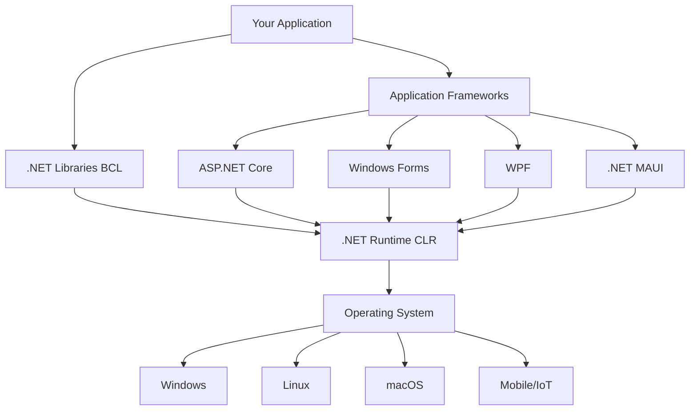

# Module 03: .NET Core Basics - Introduction

## 📘 Understanding the .NET Ecosystem

.NET is not just a programming language—it's a complete development platform with runtime, libraries, tools, and languages. Understanding the .NET ecosystem is crucial for building professional applications.

## 🎯 Module Objectives

By the end of this module, you will:

- ✅ Understand the .NET architecture and components
- ✅ Master the .NET CLI (Command Line Interface)
- ✅ Navigate project structure and configuration
- ✅ Understand the build and publish process
- ✅ Work with NuGet packages
- ✅ Configure applications properly
- ✅ Understand different .NET project types
- ✅ Use debugging and diagnostic tools

## 🗺️ Module Structure

### Lessons
1. **Introduction** (this document) - .NET ecosystem overview
2. **The .NET Platform** - Runtime, SDK, BCL, frameworks
3. **Project System** - .csproj files, MSBuild, project types
4. **CLI Tools** - dotnet commands, scaffolding, tooling
5. **NuGet Package Management** - Dependencies, versioning, package creation
6. **Configuration** - appsettings.json, environment variables, options pattern
7. **Debugging & Diagnostics** - Debugging techniques, logging, profiling
8. **Best Practices** - Project organization, deployment strategies

### Time Commitment
- **Estimated Time**: 1-2 weeks
- **Lessons**: 6-8 hours
- **Exercises**: 8-12 hours
- **Projects**: 5-8 hours

## 🏗️ The .NET Platform Architecture

### High-Level Overview



### Key Components

#### 1. Languages
- **C#**: Primary language, modern object-oriented
- **F#**: Functional-first language
- **Visual Basic**: Legacy support

#### 2. Runtime (CLR - Common Language Runtime)
- **JIT Compiler**: Just-In-Time compilation
- **Garbage Collector**: Automatic memory management
- **Type System**: Common Type System (CTS)
- **Exception Handling**: Unified exception model
- **Security**: Code Access Security (CAS)

#### 3. Base Class Library (BCL)
- **Core types**: String, DateTime, Collections
- **I/O**: File system, networking, streams
- **Threading**: Tasks, async/await, synchronization
- **Security**: Cryptography, authentication
- **Data**: XML, JSON, databases

#### 4. Application Frameworks
- **ASP.NET Core**: Web applications and APIs
- **Entity Framework Core**: ORM for databases
- **ML.NET**: Machine learning
- **Blazor**: Web UI with C#
- **.NET MAUI**: Cross-platform mobile and desktop

## 📊 .NET Versions and History

### .NET Evolution

| Version | Release | Type | Support | Key Features |
|---------|---------|------|---------|--------------|
| .NET Framework 1.0 | 2002 | Windows-only | Ended | Original .NET |
| .NET Framework 4.8 | 2019 | Windows-only | Active | Last Framework version |
| .NET Core 1.0 | 2016 | Cross-platform | Ended | New cross-platform runtime |
| .NET Core 3.1 | 2019 | Cross-platform | LTS (ended) | Last Core version |
| .NET 5 | 2020 | Cross-platform | Ended | Unified platform |
| .NET 6 | 2021 | Cross-platform | LTS | Long-term support |
| .NET 7 | 2022 | Cross-platform | STS | Standard support |
| .NET 8 | 2023 | Cross-platform | LTS | Current LTS |
| **.NET 9** | 2024 | Cross-platform | STS | Latest features |
| **.NET 10** | 2025 | Cross-platform | **LTS** | **Current (use this!)** |

### Support Policies

**LTS (Long-Term Support):**
- 3 years of support
- Recommended for production
- Examples: .NET 6, 8, 10

**STS (Standard-Term Support):**
- 18 months of support
- Latest features
- Examples: .NET 7, 9

**Why .NET 10?**
- ✅ LTS (3 years support until November 2028)
- ✅ Latest C# 14 language features
- ✅ Performance improvements
- ✅ AI integration (Microsoft Agent Framework)
- ✅ Enhanced ASP.NET Core features
- ✅ Improved tooling and diagnostics

## 🔧 .NET SDK vs Runtime

### .NET Runtime
**What it is:**
- Executes .NET applications
- Includes CLR and libraries
- Required to run apps

**When you need it:**
- Running published applications
- Production servers
- End-user machines

**Installation size:** ~50-100 MB

### .NET SDK
**What it is:**
- Development toolkit
- Includes Runtime + Build tools
- Compiler, debugger, CLI tools

**When you need it:**
- Development machines
- Build servers (CI/CD)
- Creating applications

**Installation size:** ~200-400 MB

### Check Installed Versions

```bash
# Check SDK versions
dotnet --list-sdks
# Output: 10.0.100 [C:\Program Files\dotnet\sdk]

# Check Runtime versions
dotnet --list-runtimes
# Output:
# Microsoft.AspNetCore.App 10.0.0 [C:\Program Files\dotnet\shared\Microsoft.AspNetCore.App]
# Microsoft.NETCore.App 10.0.0 [C:\Program Files\dotnet\shared\Microsoft.NETCore.App]

# Check current version
dotnet --version
# Output: 10.0.100

# Full info
dotnet --info
```

## 🎯 .NET Project Types

### Console Application
**Purpose:** Command-line tools, batch processing, scripts

```bash
dotnet new console -n MyConsoleApp
```

**Use cases:**
- CLI tools
- Background jobs
- Data processing scripts
- Automation tasks

### Class Library
**Purpose:** Reusable code packages

```bash
dotnet new classlib -n MyLibrary
```

**Use cases:**
- Shared business logic
- Utility functions
- NuGet packages

### Web Application (ASP.NET Core)
**Purpose:** Web sites and web APIs

```bash
# Web API
dotnet new webapi -n MyApi

# MVC Web App
dotnet new mvc -n MyWebApp

# Razor Pages
dotnet new razor -n MyRazorApp

# Blazor Server
dotnet new blazorserver -n MyBlazorApp

# Minimal API
dotnet new web -n MyMinimalApi
```

**Use cases:**
- RESTful APIs
- Web applications
- Microservices
- Real-time apps (SignalR)

### Test Projects
**Purpose:** Unit and integration testing

```bash
# xUnit (recommended)
dotnet new xunit -n MyTests

# NUnit
dotnet new nunit -n MyTests

# MSTest
dotnet new mstest -n MyTests
```

### Worker Service
**Purpose:** Background services, hosted services

```bash
dotnet new worker -n MyWorker
```

**Use cases:**
- Windows Services
- Linux daemons
- Message queue processors
- Scheduled tasks

## 🗂️ Project File Structure

### Basic Console App Structure

```
MyConsoleApp/
├── Program.cs              # Entry point
├── MyConsoleApp.csproj     # Project file
├── bin/                    # Build output (generated)
│   ├── Debug/
│   └── Release/
└── obj/                    # Intermediate files (generated)
    ├── Debug/
    └── Release/
```

### Web API Structure

```
MyWebApi/
├── Program.cs              # Entry point & configuration
├── MyWebApi.csproj         # Project file
├── appsettings.json        # Configuration
├── appsettings.Development.json
├── Controllers/            # API controllers
│   └── WeatherForecastController.cs
├── Models/                 # Data models
│   └── WeatherForecast.cs
├── Services/               # Business logic
├── Properties/
│   └── launchSettings.json # Development settings
├── bin/                    # Build output
└── obj/                    # Intermediate files
```

### Typical Project Structure (.csproj)

```xml
<Project Sdk="Microsoft.NET.Sdk">
  <!-- Project Configuration -->
  <PropertyGroup>
    <!-- Target framework -->
    <TargetFramework>net10.0</TargetFramework>

    <!-- Output type (Exe for console, Library for class library) -->
    <OutputType>Exe</OutputType>

    <!-- Enable nullable reference types -->
    <Nullable>enable</Nullable>

    <!-- Implicit usings (auto-import common namespaces) -->
    <ImplicitUsings>enable</ImplicitUsings>

    <!-- Language version -->
    <LangVersion>latest</LangVersion>

    <!-- Assembly info -->
    <AssemblyName>MyApp</AssemblyName>
    <RootNamespace>MyApp</RootNamespace>
    <Version>1.0.0</Version>
  </PropertyGroup>

  <!-- NuGet Package References -->
  <ItemGroup>
    <PackageReference Include="Newtonsoft.Json" Version="13.0.3" />
    <PackageReference Include="Serilog" Version="3.1.1" />
  </ItemGroup>

  <!-- Project References -->
  <ItemGroup>
    <ProjectReference Include="..\MyLibrary\MyLibrary.csproj" />
  </ItemGroup>
</Project>
```

### Understanding .csproj Elements

#### PropertyGroup
```xml
<PropertyGroup>
  <!-- Which .NET version to target -->
  <TargetFramework>net10.0</TargetFramework>

  <!-- Can target multiple frameworks -->
  <!-- <TargetFrameworks>net10.0;net8.0</TargetFrameworks> -->

  <!-- Nullable reference types (C# 8+) -->
  <Nullable>enable</Nullable>
  <!-- Options: enable, disable, warnings, annotations -->

  <!-- Implicit usings (C# 10+) -->
  <ImplicitUsings>enable</ImplicitUsings>
  <!-- Auto-imports common namespaces like System, System.Collections.Generic -->

  <!-- Treat warnings as errors -->
  <TreatWarningsAsErrors>true</TreatWarningsAsErrors>

  <!-- Generate XML documentation -->
  <GenerateDocumentationFile>true</GenerateDocumentationFile>
</PropertyGroup>
```

#### PackageReference
```xml
<ItemGroup>
  <!-- NuGet package with specific version -->
  <PackageReference Include="PackageName" Version="1.0.0" />

  <!-- Version wildcards -->
  <PackageReference Include="PackageName" Version="1.*" />

  <!-- Version range -->
  <PackageReference Include="PackageName" Version="[1.0.0, 2.0.0)" />
</ItemGroup>
```

## 🚀 The Build Process

### Build Pipeline


### Build Commands

```bash
# Restore NuGet packages
dotnet restore

# Build project (Debug configuration)
dotnet build

# Build in Release mode
dotnet build --configuration Release

# Clean build artifacts
dotnet clean

# Rebuild (clean + build)
dotnet clean && dotnet build

# Run application
dotnet run

# Run with specific configuration
dotnet run --configuration Release
```

### Publish for Deployment

```bash
# Publish self-contained (includes runtime)
dotnet publish -c Release -r win-x64 --self-contained

# Publish framework-dependent (requires runtime installed)
dotnet publish -c Release --no-self-contained

# Single-file publish
dotnet publish -c Release -r win-x64 -p:PublishSingleFile=true

# Ahead-of-Time (AOT) compilation (faster startup)
dotnet publish -c Release -r linux-x64 -p:PublishAot=true

# Output to specific directory
dotnet publish -o ./publish
```

#### Runtime Identifiers (RID)

| Platform | RID | Use Case |
|----------|-----|----------|
| Windows x64 | `win-x64` | Most Windows PCs |
| Windows ARM | `win-arm64` | Windows on ARM |
| Linux x64 | `linux-x64` | Most Linux servers |
| Linux ARM | `linux-arm64` | Raspberry Pi, AWS Graviton |
| macOS x64 | `osx-x64` | Intel Macs |
| macOS ARM | `osx-arm64` | Apple Silicon Macs |

## 🎓 Development Workflow

### Typical Development Cycle

```bash
# 1. Create new project
dotnet new console -n MyApp
cd MyApp

# 2. Add packages
dotnet add package Newtonsoft.Json

# 3. Write code
# Edit Program.cs

# 4. Run (automatically builds)
dotnet run

# 5. Test
dotnet test

# 6. Build for production
dotnet build -c Release

# 7. Publish
dotnet publish -c Release
```

### Solution Files (.sln)

For multi-project solutions:

```bash
# Create solution
dotnet new sln -n MySolution

# Create projects
dotnet new console -n MyApp
dotnet new classlib -n MyLibrary
dotnet new xunit -n MyApp.Tests

# Add projects to solution
dotnet sln add MyApp/MyApp.csproj
dotnet sln add MyLibrary/MyLibrary.csproj
dotnet sln add MyApp.Tests/MyApp.Tests.csproj

# Add project reference
cd MyApp
dotnet add reference ../MyLibrary/MyLibrary.csproj

# Build entire solution
dotnet build
```

Solution structure:
```
MySolution/
├── MySolution.sln
├── MyApp/
│   └── MyApp.csproj
├── MyLibrary/
│   └── MyLibrary.csproj
└── MyApp.Tests/
    └── MyApp.Tests.csproj
```

## 💡 Key Concepts

### 1. Intermediate Language (IL)

```csharp
// Your C# code
public int Add(int a, int b)
{
    return a + b;
}

// Compiled to IL (Intermediate Language)
// .method public hidebysig instance int32 Add(int32 a, int32 b) cil managed
// {
//   .maxstack 2
//   ldarg.1      // Load argument 1 (a)
//   ldarg.2      // Load argument 2 (b)
//   add          // Add them
//   ret          // Return result
// }
```

**Why IL?**
- Platform independence
- Security verification
- JIT optimization opportunities

### 2. JIT vs AOT Compilation

**JIT (Just-In-Time):**
- Compiles IL to native code at runtime
- Optimizes based on actual usage
- Slower startup, faster steady-state
- Default mode

**AOT (Ahead-of-Time):**
- Compiles to native code during build
- Faster startup
- Smaller runtime footprint
- No runtime JIT overhead
- Used in .NET Native AOT

### 3. Managed vs Unmanaged Code

**Managed Code:**
- Runs under CLR control
- Automatic memory management (GC)
- Type safety enforced
- Exception handling
- Most C# code

**Unmanaged Code:**
- Runs directly on OS
- Manual memory management
- No type safety guarantees
- Interop scenarios (P/Invoke)
- Native libraries

## ✅ Prerequisites Check

Before proceeding, ensure you have:

- [ ] .NET 10 SDK installed
- [ ] Comfortable with command line
- [ ] Completed Modules 01-02
- [ ] Understand C# basics and OOP

## ⏭️ Next Steps

Ready to dive deeper? Proceed to:
- **[Lesson 02: The .NET Platform](02-dotnet-platform.md)**

You'll learn about:
- CLR internals
- Garbage collection deep dive
- Type system details
- Assembly structure
- Reflection and metadata

## 📚 Additional Resources

- [.NET Documentation](https://learn.microsoft.com/en-us/dotnet/)
- [.NET 10 What's New](https://learn.microsoft.com/en-us/dotnet/core/whats-new/dotnet-10/overview)
- [.NET CLI Reference](https://learn.microsoft.com/en-us/dotnet/core/tools/)
- [Project File Reference](https://learn.microsoft.com/en-us/dotnet/core/project-sdk/overview)

---

*".NET is not just a framework; it's a complete ecosystem for building modern applications." - Microsoft*
