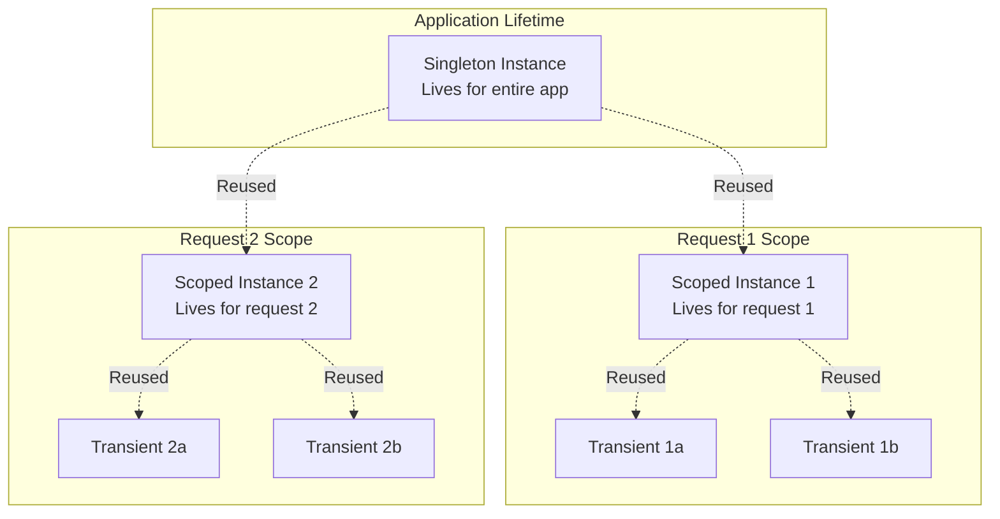

# Lesson 01: Dependency Injection & Inversion of Control

## 🎯 Learning Objectives

By the end of this lesson, you will understand:

- **What** Dependency Injection (DI) and Inversion of Control (IoC) are
- **Why** DI is essential for modern application development
- **How** to implement DI in .NET applications
- Service lifetimes: Transient, Scoped, and Singleton
- Constructor vs Property vs Method injection
- Common pitfalls and how to avoid them
- Best practices for production applications

## 📚 Table of Contents

1. [What is Dependency Injection?](#what-is-dependency-injection)
2. [The Problem: Tight Coupling](#the-problem-tight-coupling)
3. [The Solution: Dependency Injection](#the-solution-dependency-injection)
4. [Inversion of Control (IoC)](#inversion-of-control-ioc)
5. [DI Patterns](#di-patterns)
6. [Service Lifetimes](#service-lifetimes)
7. [.NET Built-in DI Container](#net-built-in-di-container)
8. [Real-World Examples](#real-world-examples)
9. [Common Pitfalls](#common-pitfalls)
10. [Best Practices](#best-practices)

---

## What is Dependency Injection?

**Dependency Injection** is a design pattern where objects receive their dependencies from external sources rather than creating them internally.

**Simple Analogy:**
- ❌ **Without DI**: You build your own car from scratch every time you need to drive
- ✅ **With DI**: Someone hands you a car that's already built and ready to drive

### The Core Principle

```csharp
// ❌ BAD: Class creates its own dependencies (tight coupling)
public class OrderService
{
    private readonly EmailSender _emailSender;

    public OrderService()
    {
        _emailSender = new EmailSender();  // Hard-coded dependency!
    }

    public void PlaceOrder(Order order)
    {
        // Process order...
        _emailSender.SendConfirmation(order);
    }
}

// ✅ GOOD: Dependencies are injected (loose coupling)
public class OrderService
{
    private readonly IEmailSender _emailSender;

    // Dependency is injected through constructor
    public OrderService(IEmailSender emailSender)
    {
        _emailSender = emailSender;
    }

    public void PlaceOrder(Order order)
    {
        // Process order...
        _emailSender.SendConfirmation(order);
    }
}
```

**Why is the second approach better?**
1. **Testability**: Can inject a mock `IEmailSender` in tests
2. **Flexibility**: Can swap implementations without changing `OrderService`
3. **Maintainability**: Changes to `EmailSender` construction don't affect `OrderService`
4. **Single Responsibility**: `OrderService` doesn't know HOW to create an `EmailSender`

---

## The Problem: Tight Coupling

Let's see a real-world example of tightly coupled code:

```csharp
// Tightly coupled: OrderService depends on concrete implementations
public class OrderService
{
    private readonly SqlServerDatabase _database;
    private readonly SmtpEmailSender _emailSender;
    private readonly StripePaymentGateway _paymentGateway;
    private readonly FileLogger _logger;

    public OrderService()
    {
        // Hard-coded dependencies
        _database = new SqlServerDatabase("Server=localhost;Database=Orders");
        _emailSender = new SmtpEmailSender("smtp.gmail.com", 587);
        _paymentGateway = new StripePaymentGateway("sk_test_123");
        _logger = new FileLogger("C:\\logs\\orders.log");
    }

    public async Task<bool> PlaceOrderAsync(Order order)
    {
        try
        {
            // Validate order
            if (!order.IsValid())
                return false;

            // Process payment
            var paymentResult = await _paymentGateway.ChargeAsync(
                order.Total, order.PaymentMethod);

            if (!paymentResult.Success)
                return false;

            // Save to database
            await _database.SaveOrderAsync(order);

            // Send confirmation email
            await _emailSender.SendAsync(
                order.CustomerEmail,
                "Order Confirmation",
                $"Your order #{order.Id} has been placed!");

            _logger.Log($"Order {order.Id} placed successfully");
            return true;
        }
        catch (Exception ex)
        {
            _logger.Log($"Error placing order: {ex.Message}");
            return false;
        }
    }
}
```

### Problems with This Approach

1. **Cannot Test**: How do you test without sending real emails or charging real credit cards?
2. **Hard to Change**: Want to switch from SQL Server to PostgreSQL? Modify `OrderService`!
3. **Configuration Nightmare**: Connection strings and API keys are hard-coded
4. **Violates SRP**: `OrderService` knows how to create databases, email senders, etc.
5. **Cannot Reuse**: Each class that needs a database creates its own instance

**Memory Impact:**
```
If 100 services each create their own SqlServerDatabase:
- 100 database connections
- 100 connection pools
- Potential connection exhaustion!
```

---

## The Solution: Dependency Injection

Let's refactor using Dependency Injection:

```csharp
// Step 1: Define abstractions (interfaces)
public interface IDatabase
{
    Task SaveOrderAsync(Order order);
}

public interface IEmailSender
{
    Task SendAsync(string to, string subject, string body);
}

public interface IPaymentGateway
{
    Task<PaymentResult> ChargeAsync(decimal amount, PaymentMethod method);
}

public interface ILogger
{
    void Log(string message);
}

// Step 2: Refactor OrderService to depend on abstractions
public class OrderService
{
    private readonly IDatabase _database;
    private readonly IEmailSender _emailSender;
    private readonly IPaymentGateway _paymentGateway;
    private readonly ILogger _logger;

    // Dependencies injected through constructor
    public OrderService(
        IDatabase database,
        IEmailSender emailSender,
        IPaymentGateway paymentGateway,
        ILogger logger)
    {
        // Assign injected dependencies
        _database = database ?? throw new ArgumentNullException(nameof(database));
        _emailSender = emailSender ?? throw new ArgumentNullException(nameof(emailSender));
        _paymentGateway = paymentGateway ?? throw new ArgumentNullException(nameof(paymentGateway));
        _logger = logger ?? throw new ArgumentNullException(nameof(logger));
    }

    public async Task<bool> PlaceOrderAsync(Order order)
    {
        try
        {
            if (!order.IsValid())
                return false;

            var paymentResult = await _paymentGateway.ChargeAsync(
                order.Total, order.PaymentMethod);

            if (!paymentResult.Success)
                return false;

            await _database.SaveOrderAsync(order);

            await _emailSender.SendAsync(
                order.CustomerEmail,
                "Order Confirmation",
                $"Your order #{order.Id} has been placed!");

            _logger.Log($"Order {order.Id} placed successfully");
            return true;
        }
        catch (Exception ex)
        {
            _logger.Log($"Error placing order: {ex.Message}");
            return false;
        }
    }
}

// Step 3: Concrete implementations
public class SqlServerDatabase : IDatabase
{
    private readonly string _connectionString;

    public SqlServerDatabase(string connectionString)
    {
        _connectionString = connectionString;
    }

    public async Task SaveOrderAsync(Order order)
    {
        // SQL Server implementation
    }
}

public class SmtpEmailSender : IEmailSender
{
    private readonly string _host;
    private readonly int _port;

    public SmtpEmailSender(string host, int port)
    {
        _host = host;
        _port = port;
    }

    public async Task SendAsync(string to, string subject, string body)
    {
        // SMTP implementation
    }
}

// Step 4: Easy to test with mocks!
public class MockEmailSender : IEmailSender
{
    public List<(string To, string Subject, string Body)> SentEmails { get; } = new();

    public Task SendAsync(string to, string subject, string body)
    {
        SentEmails.Add((to, subject, body));
        return Task.CompletedTask;
    }
}

// Unit test becomes trivial
[Fact]
public async Task PlaceOrder_SendsConfirmationEmail()
{
    // Arrange
    var mockDatabase = new Mock<IDatabase>();
    var mockEmailSender = new MockEmailSender();
    var mockPayment = new Mock<IPaymentGateway>();
    mockPayment.Setup(p => p.ChargeAsync(It.IsAny<decimal>(), It.IsAny<PaymentMethod>()))
        .ReturnsAsync(new PaymentResult { Success = true });
    var mockLogger = new Mock<ILogger>();

    var orderService = new OrderService(
        mockDatabase.Object,
        mockEmailSender,
        mockPayment.Object,
        mockLogger.Object);

    var order = new Order
    {
        Id = 1,
        CustomerEmail = "customer@example.com",
        Total = 99.99m
    };

    // Act
    await orderService.PlaceOrderAsync(order);

    // Assert
    Assert.Single(mockEmailSender.SentEmails);
    Assert.Equal("customer@example.com", mockEmailSender.SentEmails[0].To);
    Assert.Contains("Order Confirmation", mockEmailSender.SentEmails[0].Subject);
}
```

### Benefits Achieved

✅ **Testability**: Can inject mocks for testing
✅ **Flexibility**: Can swap implementations (SQL → PostgreSQL)
✅ **Configuration**: Settings injected from config files
✅ **Reusability**: Share single database instance across services
✅ **Maintainability**: Changes to implementations don't affect consumers

---

## Inversion of Control (IoC)

**Inversion of Control** is a broader principle where the framework controls the flow of your application, not your code.

### Traditional Control Flow

```csharp
// Your code controls everything
public class Program
{
    public static void Main()
    {
        var database = new SqlServerDatabase("connection_string");
        var emailSender = new SmtpEmailSender("smtp.gmail.com", 587);
        var logger = new FileLogger("logs.txt");
        var paymentGateway = new StripePaymentGateway("api_key");

        // You manually create and wire up everything
        var orderService = new OrderService(database, emailSender, paymentGateway, logger);
        var cartService = new CartService(database, logger);
        var userService = new UserService(database, emailSender, logger);

        // You control when things are created and disposed
    }
}
```

### IoC Control Flow

```csharp
// Framework controls object creation and lifetime
public class Program
{
    public static void Main(string[] args)
    {
        var builder = WebApplication.CreateBuilder(args);

        // Tell the container how to create things
        builder.Services.AddScoped<IDatabase, SqlServerDatabase>();
        builder.Services.AddTransient<IEmailSender, SmtpEmailSender>();
        builder.Services.AddSingleton<ILogger, FileLogger>();
        builder.Services.AddScoped<IPaymentGateway, StripePaymentGateway>();

        builder.Services.AddScoped<OrderService>();
        builder.Services.AddScoped<CartService>();
        builder.Services.AddScoped<UserService>();

        var app = builder.Build();

        // Framework creates instances automatically when needed
        // Framework manages lifetimes and disposal
        // You just use them!

        app.Run();
    }
}

// In your controller - framework injects automatically!
[ApiController]
[Route("api/[controller]")]
public class OrdersController : ControllerBase
{
    private readonly OrderService _orderService;

    // Framework automatically resolves and injects OrderService
    // OrderService's dependencies are also automatically resolved!
    public OrdersController(OrderService orderService)
    {
        _orderService = orderService;
    }

    [HttpPost]
    public async Task<IActionResult> PlaceOrder([FromBody] Order order)
    {
        var result = await _orderService.PlaceOrderAsync(order);
        return result ? Ok() : BadRequest();
    }
}
```

**Key Differences:**

| Aspect | Traditional | IoC Container |
|--------|-------------|---------------|
| **Object Creation** | You create manually | Container creates automatically |
| **Dependency Resolution** | You wire manually | Container resolves automatically |
| **Lifetime Management** | You manage manually | Container manages automatically |
| **Disposal** | You dispose manually | Container disposes automatically |
| **Configuration** | Hard-coded | Centralized registration |

---

## DI Patterns

There are three main patterns for injecting dependencies:

### 1. Constructor Injection (Recommended ✅)

```csharp
/// <summary>
/// Constructor injection is the PREFERRED pattern.
/// Dependencies are required and immutable after construction.
/// </summary>
public class OrderService
{
    private readonly IDatabase _database;
    private readonly ILogger _logger;

    public OrderService(IDatabase database, ILogger logger)
    {
        _database = database ?? throw new ArgumentNullException(nameof(database));
        _logger = logger ?? throw new ArgumentNullException(nameof(logger));
    }

    public void ProcessOrder(Order order)
    {
        _database.Save(order);
        _logger.Log($"Order {order.Id} processed");
    }
}
```

**Advantages:**
- ✅ Dependencies are **explicit** in the constructor
- ✅ Dependencies are **required** - class cannot be constructed without them
- ✅ Dependencies are **immutable** - cannot be changed after construction
- ✅ Easy to **test** - just pass mocks to constructor
- ✅ Clear **API** - you know exactly what's needed

**Use When:**
- Dependency is **required** for class to function
- Dependency **won't change** during object lifetime
- You want **thread safety** (readonly fields)

### 2. Property Injection (Use Sparingly ⚠️)

```csharp
/// <summary>
/// Property injection for optional dependencies.
/// Use sparingly - only when dependency is truly optional.
/// </summary>
public class OrderService
{
    private readonly IDatabase _database;

    // Optional logger with default fallback
    public ILogger Logger { get; set; } = new NullLogger();

    public OrderService(IDatabase database)
    {
        _database = database;
    }

    public void ProcessOrder(Order order)
    {
        _database.Save(order);
        Logger.Log($"Order {order.Id} processed");  // Safe even if not set
    }
}

// Usage
var service = new OrderService(database);
service.Logger = new FileLogger();  // Optional: set if needed
```

**Advantages:**
- ✅ Good for **optional** dependencies
- ✅ Can provide **default** implementations
- ✅ Useful for **legacy code** migration

**Disadvantages:**
- ❌ Dependencies are **hidden** - not in constructor signature
- ❌ Dependencies are **mutable** - can be changed anytime
- ❌ **Not thread-safe** by default
- ❌ Can lead to **null reference** exceptions

**Use When:**
- Dependency is **truly optional**
- You have a **sensible default** implementation
- You need to **change** the dependency at runtime (rare)

### 3. Method Injection

```csharp
/// <summary>
/// Method injection when dependency varies per method call.
/// </summary>
public class ReportGenerator
{
    public string GenerateReport(IDataSource dataSource, ReportType type)
    {
        // dataSource is injected per method call
        var data = dataSource.GetData();

        return type switch
        {
            ReportType.PDF => GeneratePdf(data),
            ReportType.Excel => GenerateExcel(data),
            _ => throw new ArgumentException("Invalid report type")
        };
    }
}

// Usage - can use different data sources per call
var generator = new ReportGenerator();
var salesReport = generator.GenerateReport(new SqlDataSource(), ReportType.PDF);
var inventoryReport = generator.GenerateReport(new ExcelDataSource(), ReportType.Excel);
```

**Use When:**
- Dependency **varies per method call**
- You need different implementations for **different operations**
- Dependency is **contextual** to the operation

---

## Service Lifetimes

.NET's DI container supports three service lifetimes that control when instances are created and disposed:

### 1. Transient ♻️

**New instance created every time it's requested.**

```csharp
// Registration
builder.Services.AddTransient<IEmailSender, SmtpEmailSender>();

// Behavior
var sender1 = serviceProvider.GetService<IEmailSender>();  // New instance
var sender2 = serviceProvider.GetService<IEmailSender>();  // New instance
// sender1 != sender2 (different instances)
```

**When to Use:**
- ✅ Lightweight services with **no state**
- ✅ Services that are **not thread-safe**
- ✅ Short-lived operations
- ✅ Services with **minimal setup cost**

**Examples:**
```csharp
// Perfect for transient
builder.Services.AddTransient<IEmailSender, SmtpEmailSender>();
builder.Services.AddTransient<IDateTimeProvider, DateTimeProvider>();
builder.Services.AddTransient<IGuidGenerator, GuidGenerator>();
builder.Services.AddTransient<IValidator<Order>, OrderValidator>();
```

**Performance:**
- Object creation overhead on every request
- More garbage collection pressure
- Fine for lightweight objects

### 2. Scoped 📦

**One instance per scope (typically per HTTP request in web apps).**

```csharp
// Registration
builder.Services.AddScoped<IDatabase, SqlServerDatabase>();

// Behavior in Web API
// Request 1 starts
var db1 = serviceProvider.GetService<IDatabase>();  // New instance
var db2 = serviceProvider.GetService<IDatabase>();  // Same instance!
// db1 == db2 within the same request

// Request 1 ends - db1/db2 disposed

// Request 2 starts
var db3 = serviceProvider.GetService<IDatabase>();  // New instance
// db3 != db1 (different request scope)
```

**When to Use:**
- ✅ **Database contexts** (Entity Framework DbContext)
- ✅ **Unit of Work** pattern
- ✅ Services that maintain **per-request state**
- ✅ Services that coordinate **transactions**

**Examples:**
```csharp
// Perfect for scoped
builder.Services.AddScoped<AppDbContext>();
builder.Services.AddScoped<IUnitOfWork, UnitOfWork>();
builder.Services.AddScoped<IOrderService, OrderService>();
builder.Services.AddScoped<ICurrentUser, CurrentUser>();  // User info per request
```

**Performance:**
- One instance per request - good balance
- Automatic disposal at end of scope
- Ideal for DbContext (one per request)

### 3. Singleton 🔒

**Single instance for the entire application lifetime.**

```csharp
// Registration
builder.Services.AddSingleton<ILogger, FileLogger>();

// Behavior
var logger1 = serviceProvider.GetService<ILogger>();  // New instance
var logger2 = serviceProvider.GetService<ILogger>();  // Same instance!
var logger3 = serviceProvider.GetService<ILogger>();  // Same instance!
// logger1 == logger2 == logger3 (always the same instance)

// Disposed only when application shuts down
```

**When to Use:**
- ✅ **Stateless** services
- ✅ **Thread-safe** services
- ✅ **Expensive to create** (caches, connections)
- ✅ **Configuration** objects
- ✅ Services that maintain **global state**

**Examples:**
```csharp
// Perfect for singleton
builder.Services.AddSingleton<ILogger, FileLogger>();
builder.Services.AddSingleton<IMemoryCache, MemoryCache>();
builder.Services.AddSingleton<IConfiguration>(configuration);
builder.Services.AddSingleton<IHttpClientFactory, HttpClientFactory>();
```

**⚠️ Singleton Safety Rules:**
1. **MUST be thread-safe** - accessed by multiple threads concurrently
2. **Should be stateless** or have thread-safe state management
3. **Cannot depend on scoped services** (see captive dependencies below)

**Performance:**
- Created once - very efficient
- No garbage collection (lives until app shutdown)
- Best for expensive-to-create objects

### Lifetime Comparison

```csharp
public class LifetimeDemoController : ControllerBase
{
    private readonly ITransientService _transient1;
    private readonly ITransientService _transient2;
    private readonly IScopedService _scoped1;
    private readonly IScopedService _scoped2;
    private readonly ISingletonService _singleton1;
    private readonly ISingletonService _singleton2;

    public LifetimeDemoController(
        ITransientService transient1,
        ITransientService transient2,
        IScopedService scoped1,
        IScopedService scoped2,
        ISingletonService singleton1,
        ISingletonService singleton2)
    {
        _transient1 = transient1;
        _transient2 = transient2;
        _scoped1 = scoped1;
        _scoped2 = scoped2;
        _singleton1 = singleton1;
        _singleton2 = singleton2;
    }

    [HttpGet]
    public IActionResult Get()
    {
        return Ok(new
        {
            Transient = new
            {
                Instance1 = _transient1.InstanceId,
                Instance2 = _transient2.InstanceId,
                AreEqual = _transient1.InstanceId == _transient2.InstanceId  // FALSE
            },
            Scoped = new
            {
                Instance1 = _scoped1.InstanceId,
                Instance2 = _scoped2.InstanceId,
                AreEqual = _scoped1.InstanceId == _scoped2.InstanceId  // TRUE (same request)
            },
            Singleton = new
            {
                Instance1 = _singleton1.InstanceId,
                Instance2 = _singleton2.InstanceId,
                AreEqual = _singleton1.InstanceId == _singleton2.InstanceId  // TRUE (always)
            }
        });
    }
}
```

### Visual Lifetime Diagram



---

## .NET Built-in DI Container

.NET includes a built-in DI container (also called IoC container or service container).

### Basic Registration

```csharp
var builder = WebApplication.CreateBuilder(args);

// Transient
builder.Services.AddTransient<IEmailSender, SmtpEmailSender>();

// Scoped
builder.Services.AddScoped<IDatabase, SqlServerDatabase>();

// Singleton
builder.Services.AddSingleton<ILogger, FileLogger>();

// Concrete class (no interface)
builder.Services.AddScoped<OrderService>();

var app = builder.Build();
```

### Registration with Factory Functions

```csharp
// When you need custom initialization logic
builder.Services.AddSingleton<IDatabase>(serviceProvider =>
{
    var configuration = serviceProvider.GetRequiredService<IConfiguration>();
    var connectionString = configuration.GetConnectionString("DefaultConnection");
    return new SqlServerDatabase(connectionString);
});

// With dependencies from container
builder.Services.AddScoped<IOrderService>(serviceProvider =>
{
    var database = serviceProvider.GetRequiredService<IDatabase>();
    var logger = serviceProvider.GetRequiredService<ILogger>();
    var config = serviceProvider.GetRequiredService<IConfiguration>();

    var maxRetries = config.GetValue<int>("OrderService:MaxRetries");

    return new OrderService(database, logger, maxRetries);
});
```

### Multiple Implementations

```csharp
// Register multiple implementations
builder.Services.AddTransient<INotificationSender, EmailNotificationSender>();
builder.Services.AddTransient<INotificationSender, SmsNotificationSender>();
builder.Services.AddTransient<INotificationSender, PushNotificationSender>();

// Use all implementations
public class NotificationService
{
    private readonly IEnumerable<INotificationSender> _senders;

    public NotificationService(IEnumerable<INotificationSender> senders)
    {
        _senders = senders;  // All 3 implementations injected!
    }

    public async Task SendToAllChannels(string message)
    {
        foreach (var sender in _senders)
        {
            await sender.SendAsync(message);
        }
    }
}
```

### Resolving Services

```csharp
// In ASP.NET Core, injection is automatic
public class OrdersController : ControllerBase
{
    private readonly IOrderService _orderService;

    // Framework resolves IOrderService automatically
    public OrdersController(IOrderService orderService)
    {
        _orderService = orderService;
    }
}

// Manual resolution (avoid this in application code)
using var scope = app.Services.CreateScope();
var orderService = scope.ServiceProvider.GetRequiredService<IOrderService>();
// Use GetRequiredService (throws if not registered)
// Use GetService (returns null if not registered)
```

---

## Real-World Examples

### Example 1: E-Commerce Order Processing

```csharp
// Domain models
public class Order
{
    public int Id { get; set; }
    public string CustomerEmail { get; set; }
    public decimal Total { get; set; }
    public List<OrderItem> Items { get; set; }
}

// Abstractions
public interface IOrderRepository
{
    Task<Order> GetByIdAsync(int id);
    Task<int> CreateAsync(Order order);
    Task UpdateAsync(Order order);
}

public interface IInventoryService
{
    Task<bool> ReserveItemsAsync(List<OrderItem> items);
    Task ReleaseItemsAsync(List<OrderItem> items);
}

public interface IPaymentService
{
    Task<PaymentResult> ProcessPaymentAsync(decimal amount, PaymentMethod method);
}

public interface IEmailService
{
    Task SendOrderConfirmationAsync(Order order);
}

public interface IOrderEventPublisher
{
    Task PublishOrderPlacedAsync(Order order);
}

// Service with injected dependencies
public class OrderService
{
    private readonly IOrderRepository _orderRepository;
    private readonly IInventoryService _inventoryService;
    private readonly IPaymentService _paymentService;
    private readonly IEmailService _emailService;
    private readonly IOrderEventPublisher _eventPublisher;
    private readonly ILogger<OrderService> _logger;

    public OrderService(
        IOrderRepository orderRepository,
        IInventoryService inventoryService,
        IPaymentService paymentService,
        IEmailService emailService,
        IOrderEventPublisher eventPublisher,
        ILogger<OrderService> logger)
    {
        _orderRepository = orderRepository;
        _inventoryService = inventoryService;
        _paymentService = paymentService;
        _emailService = emailService;
        _eventPublisher = eventPublisher;
        _logger = logger;
    }

    public async Task<Result<int>> PlaceOrderAsync(Order order)
    {
        try
        {
            // Step 1: Reserve inventory
            var inventoryReserved = await _inventoryService.ReserveItemsAsync(order.Items);
            if (!inventoryReserved)
            {
                _logger.LogWarning("Insufficient inventory for order");
                return Result<int>.Failure("Insufficient inventory");
            }

            // Step 2: Process payment
            var paymentResult = await _paymentService.ProcessPaymentAsync(
                order.Total, order.PaymentMethod);

            if (!paymentResult.Success)
            {
                _logger.LogWarning("Payment failed for order");
                await _inventoryService.ReleaseItemsAsync(order.Items);  // Rollback
                return Result<int>.Failure("Payment failed");
            }

            // Step 3: Save order
            var orderId = await _orderRepository.CreateAsync(order);
            order.Id = orderId;

            // Step 4: Send confirmation email (fire and forget)
            _ = Task.Run(() => _emailService.SendOrderConfirmationAsync(order));

            // Step 5: Publish event for other systems
            await _eventPublisher.PublishOrderPlacedAsync(order);

            _logger.LogInformation("Order {OrderId} placed successfully", orderId);
            return Result<int>.Success(orderId);
        }
        catch (Exception ex)
        {
            _logger.LogError(ex, "Error placing order");
            return Result<int>.Failure("An error occurred");
        }
    }
}

// Registration in Program.cs
builder.Services.AddScoped<IOrderRepository, OrderRepository>();
builder.Services.AddScoped<IInventoryService, InventoryService>();
builder.Services.AddScoped<IPaymentService, StripePaymentService>();
builder.Services.AddTransient<IEmailService, SmtpEmailService>();
builder.Services.AddSingleton<IOrderEventPublisher, RabbitMqEventPublisher>();
builder.Services.AddScoped<OrderService>();

// Easy to test with mocks
public class OrderServiceTests
{
    [Fact]
    public async Task PlaceOrder_InsufficientInventory_ReturnsFailure()
    {
        // Arrange
        var mockInventory = new Mock<IInventoryService>();
        mockInventory.Setup(i => i.ReserveItemsAsync(It.IsAny<List<OrderItem>>()))
            .ReturnsAsync(false);  // Simulate insufficient inventory

        var orderService = new OrderService(
            Mock.Of<IOrderRepository>(),
            mockInventory.Object,
            Mock.Of<IPaymentService>(),
            Mock.Of<IEmailService>(),
            Mock.Of<IOrderEventPublisher>(),
            Mock.Of<ILogger<OrderService>>());

        var order = new Order { Items = new List<OrderItem>() };

        // Act
        var result = await orderService.PlaceOrderAsync(order);

        // Assert
        Assert.False(result.IsSuccess);
        Assert.Contains("inventory", result.Error.ToLower());
    }
}
```

**Benefits Demonstrated:**
- ✅ `OrderService` has **6 dependencies** - all clearly visible in constructor
- ✅ Each dependency has a **single responsibility**
- ✅ Easy to **test** with mocks
- ✅ Easy to **swap implementations** (Stripe → PayPal)
- ✅ **Logging** injected - can be configured centrally
- ✅ Services are **composable** and **reusable**

---

## Common Pitfalls

### 1. Captive Dependencies ⚠️

**Problem:** Singleton depends on Scoped service

```csharp
// ❌ WRONG: Singleton capturing Scoped dependency
public class CachedOrderService  // Registered as Singleton
{
    private readonly AppDbContext _context;  // AppDbContext is Scoped!

    public CachedOrderService(AppDbContext context)
    {
        _context = context;  // DANGER: DbContext will live for app lifetime!
    }
}

// Registration
builder.Services.AddSingleton<CachedOrderService>();  // ❌ BAD
builder.Services.AddScoped<AppDbContext>();
```

**Why This Is Bad:**
- `AppDbContext` is scoped (one per request)
- `CachedOrderService` is singleton (one for app lifetime)
- The DbContext from the first request gets "captured" and reused forever!
- **Result**: Stale data, connection leaks, thread safety issues

**Solution 1:** Use IServiceProvider to resolve scoped services

```csharp
// ✅ CORRECT: Resolve scoped service per operation
public class CachedOrderService
{
    private readonly IServiceProvider _serviceProvider;

    public CachedOrderService(IServiceProvider serviceProvider)
    {
        _serviceProvider = serviceProvider;
    }

    public async Task<Order> GetOrderAsync(int id)
    {
        // Create a scope for this operation
        using var scope = _serviceProvider.CreateScope();
        var context = scope.ServiceProvider.GetRequiredService<AppDbContext>();
        return await context.Orders.FindAsync(id);
    }
}
```

**Solution 2:** Change lifetime

```csharp
// ✅ CORRECT: Make CachedOrderService scoped too
builder.Services.AddScoped<CachedOrderService>();
builder.Services.AddScoped<AppDbContext>();
```

### 2. Service Locator Anti-Pattern

**Problem:** Using `IServiceProvider` everywhere

```csharp
// ❌ BAD: Service Locator anti-pattern
public class OrderService
{
    private readonly IServiceProvider _serviceProvider;

    public OrderService(IServiceProvider serviceProvider)
    {
        _serviceProvider = serviceProvider;
    }

    public async Task PlaceOrder(Order order)
    {
        // Pulling dependencies from container - ANTI-PATTERN!
        var database = _serviceProvider.GetRequiredService<IDatabase>();
        var emailSender = _serviceProvider.GetRequiredService<IEmailSender>();
        var logger = _serviceProvider.GetRequiredService<ILogger>();

        // Use services...
    }
}
```

**Why This Is Bad:**
- Dependencies are **hidden** - not visible in constructor
- **Harder to test** - must mock IServiceProvider
- Runtime **errors** instead of compile-time errors
- Violates **Dependency Inversion Principle**

**Solution:** Constructor injection

```csharp
// ✅ GOOD: Explicit dependencies
public class OrderService
{
    private readonly IDatabase _database;
    private readonly IEmailSender _emailSender;
    private readonly ILogger _logger;

    public OrderService(IDatabase database, IEmailSender emailSender, ILogger logger)
    {
        _database = database;
        _emailSender = emailSender;
        _logger = logger;
    }

    public async Task PlaceOrder(Order order)
    {
        // Use injected dependencies
    }
}
```

### 3. Forgetting to Dispose

**Problem:** Manual service creation without disposal

```csharp
// ❌ BAD: Creating services manually without disposal
public IActionResult Get()
{
    var database = new SqlServerDatabase("connection_string");
    var orders = database.GetOrders();  // Database connection not disposed!
    return Ok(orders);
}
```

**Solution:** Let DI container manage lifetime

```csharp
// ✅ GOOD: Container manages disposal
public class OrdersController : ControllerBase
{
    private readonly IDatabase _database;

    public OrdersController(IDatabase database)
    {
        _database = database;  // Container will dispose at end of request
    }

    public IActionResult Get()
    {
        var orders = _database.GetOrders();
        return Ok(orders);
    }  // Container disposes _database here
}
```

### 4. Constructor Over-Injection

**Problem:** Too many dependencies

```csharp
// ❌ BAD: Too many dependencies (Code Smell!)
public class OrderService
{
    public OrderService(
        IDatabase database,
        IEmailSender emailSender,
        ISmsender smsSender,
        IPushSender pushSender,
        ILogger logger,
        IConfiguration config,
        IPaymentGateway payment,
        IInventoryService inventory,
        IShippingService shipping,
        ITaxCalculator taxCalculator,
        IDiscountService discounts,
        ICurrencyConverter currency)
    {
        // 12 dependencies - probably doing too much!
    }
}
```

**Why This Is Bad:**
- Violates **Single Responsibility Principle**
- Class is doing **too much**
- Hard to **understand** and **maintain**

**Solution:** Refactor into smaller services

```csharp
// ✅ GOOD: Split into focused services
public class OrderProcessingService
{
    private readonly IOrderValidator _validator;
    private readonly IOrderPersistence _persistence;
    private readonly INotificationService _notifications;
    private readonly ILogger _logger;

    public OrderProcessingService(
        IOrderValidator validator,
        IOrderPersistence persistence,
        INotificationService notifications,
        ILogger logger)
    {
        _validator = validator;
        _persistence = persistence;
        _notifications = notifications;
        _logger = logger;
    }
}

// INotificationService composes the notification logic
public class NotificationService : INotificationService
{
    private readonly IEmailSender _email;
    private readonly ISmsSender _sms;
    private readonly IPushSender _push;

    public NotificationService(IEmailSender email, ISmsSender sms, IPushSender push)
    {
        _email = email;
        _sms = sms;
        _push = push;
    }
}
```

---

## Best Practices

### 1. Depend on Abstractions (Interfaces)

```csharp
// ✅ GOOD
public class OrderService
{
    private readonly IDatabase _database;  // Interface
    private readonly IEmailSender _emailSender;  // Interface
}

// ❌ BAD
public class OrderService
{
    private readonly SqlServerDatabase _database;  // Concrete class
    private readonly SmtpEmailSender _emailSender;  // Concrete class
}
```

### 2. Use Constructor Injection (Primary Pattern)

```csharp
// ✅ GOOD: Constructor injection
public class OrderService
{
    private readonly IDatabase _database;

    public OrderService(IDatabase database)
    {
        _database = database ?? throw new ArgumentNullException(nameof(database));
    }
}
```

### 3. Validate Dependencies

```csharp
// ✅ GOOD: Validate in constructor
public OrderService(IDatabase database, ILogger logger)
{
    _database = database ?? throw new ArgumentNullException(nameof(database));
    _logger = logger ?? throw new ArgumentNullException(nameof(logger));
}

// Or use C# 11+ feature
public OrderService(IDatabase database, ILogger logger)
{
    _database = database ?? throw new ArgumentNullException(nameof(database));
    ArgumentNullException.ThrowIfNull(logger);
    _logger = logger;
}
```

### 4. Choose Appropriate Lifetime

```csharp
// Stateless, lightweight → Transient
builder.Services.AddTransient<IDateTimeProvider, DateTimeProvider>();

// Database context, per-request state → Scoped
builder.Services.AddScoped<AppDbContext>();
builder.Services.AddScoped<IUnitOfWork, UnitOfWork>();

// Expensive, stateless, thread-safe → Singleton
builder.Services.AddSingleton<IMemoryCache, MemoryCache>();
builder.Services.AddSingleton<IHttpClientFactory, HttpClientFactory>();
```

### 5. Keep Constructors Simple

```csharp
// ✅ GOOD: Constructor only assigns dependencies
public OrderService(IDatabase database, ILogger logger)
{
    _database = database;
    _logger = logger;
}

// ❌ BAD: Constructor does work
public OrderService(IDatabase database, ILogger logger)
{
    _database = database;
    _logger = logger;

    _database.Connect();  // ❌ Side effect!
    _logger.Log("Service created");  // ❌ Side effect!
    LoadConfiguration();  // ❌ Work in constructor!
}
```

### 6. Don't New Up Dependencies

```csharp
// ❌ BAD: Creating dependencies
public class OrderService
{
    private readonly IDatabase _database = new SqlServerDatabase();
}

// ✅ GOOD: Inject dependencies
public class OrderService
{
    private readonly IDatabase _database;

    public OrderService(IDatabase database)
    {
        _database = database;
    }
}
```

### 7. Document Your Dependencies

```csharp
/// <summary>
/// Service for processing customer orders.
/// </summary>
public class OrderService
{
    /// <summary>
    /// Initializes a new instance of the OrderService class.
    /// </summary>
    /// <param name="database">Database for persisting orders.</param>
    /// <param name="paymentService">Service for processing payments.</param>
    /// <param name="emailService">Service for sending order confirmations.</param>
    /// <param name="logger">Logger for tracking order operations.</param>
    public OrderService(
        IDatabase database,
        IPaymentService paymentService,
        IEmailService emailService,
        ILogger<OrderService> logger)
    {
        _database = database;
        _paymentService = paymentService;
        _emailService = emailService;
        _logger = logger;
    }
}
```

---

## Summary

**Key Takeaways:**

1. **Dependency Injection** = Objects receive dependencies from external sources
2. **Inversion of Control** = Framework controls object creation and lifetime
3. **Constructor Injection** is the preferred pattern (95% of cases)
4. **Service Lifetimes**:
   - **Transient**: New instance every time (lightweight, stateless)
   - **Scoped**: One per request (DbContext, per-request state)
   - **Singleton**: One for app lifetime (caches, thread-safe, stateless)
5. **Avoid Captive Dependencies**: Singleton cannot depend on Scoped
6. **Avoid Service Locator**: Don't inject `IServiceProvider` everywhere
7. **Keep constructors simple**: Only assign dependencies, no logic

**Benefits:**
- ✅ Testability (mock dependencies)
- ✅ Flexibility (swap implementations)
- ✅ Maintainability (loose coupling)
- ✅ Reusability (share instances)
- ✅ Single Responsibility (focus on business logic)

---

## What's Next?

In the next lessons, we'll explore:
- **Lesson 02**: Advanced DI Patterns (Decorator, Factory, Options Pattern)
- **Lesson 03**: Testing with DI (Mocking, Integration Tests)
- **Lesson 04**: Third-Party DI Containers (Autofac, Castle Windsor)

---

**Ready to practice?** Check out the exercises in `exercises/` directory!
