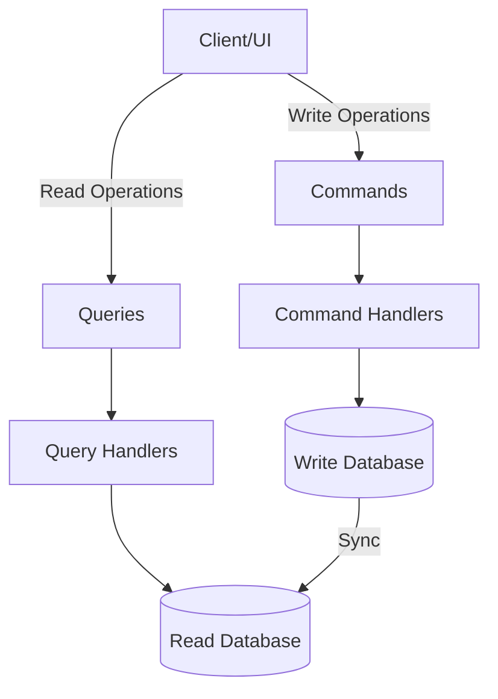
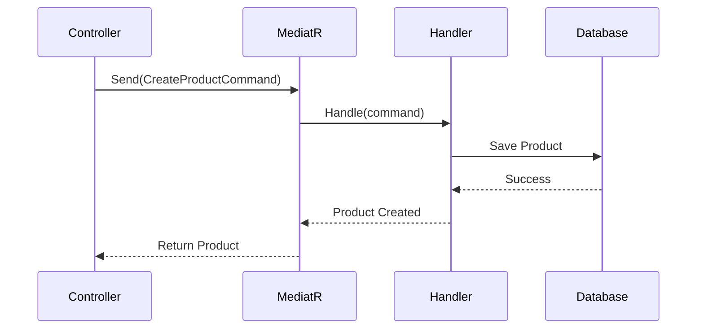

# Lesson 01: CQRS and MediatR Pattern

## 🎯 Learning Objectives

By the end of this lesson, you will understand:

- **CQRS** (Command Query Responsibility Segregation) pattern
- **MediatR** library for implementing CQRS
- **Commands vs Queries** - When to use each
- **Handlers** - Processing commands and queries
- **Pipelines** - Cross-cutting concerns
- **Notifications** - Domain events
- **Benefits and trade-offs** of CQRS
- **Real-world implementation** patterns

## 📚 Table of Contents

1. [What is CQRS?](#what-is-cqrs)
2. [Introduction to MediatR](#introduction-to-mediatr)
3. [Commands and Command Handlers](#commands-and-command-handlers)
4. [Queries and Query Handlers](#queries-and-query-handlers)
5. [Pipeline Behaviors](#pipeline-behaviors)
6. [Notifications and Domain Events](#notifications-and-domain-events)
7. [CQRS with Event Sourcing](#cqrs-with-event-sourcing)
8. [Best Practices](#best-practices)

---

## What is CQRS?

**CQRS (Command Query Responsibility Segregation)** is a pattern that separates read and write operations into different models.

### Traditional Approach (CRUD)

```csharp
// ❌ Traditional: Same model for reads and writes
public class ProductService
{
    public async Task<Product> GetProductAsync(int id)
    {
        return await _context.Products.FindAsync(id);
    }

    public async Task UpdateProductAsync(Product product)
    {
        _context.Products.Update(product);
        await _context.SaveChangesAsync();
    }
}

// Same Product model used for both reading and writing
public class Product
{
    public int Id { get; set; }
    public string Name { get; set; }
    public decimal Price { get; set; }
    // ... 50 more properties
}
```

**Problems:**
- ❌ Complex queries require loading unnecessary data
- ❌ Write operations expose all properties (security risk)
- ❌ Difficult to optimize reads vs writes separately
- ❌ Validation logic mixed with query logic

### CQRS Approach

```csharp
// ✅ CQRS: Separate models for reads and writes

// Write side - Commands
public class UpdateProductPriceCommand : IRequest<Unit>
{
    public int ProductId { get; set; }
    public decimal NewPrice { get; set; }
}

public class UpdateProductPriceHandler : IRequestHandler<UpdateProductPriceCommand, Unit>
{
    private readonly IApplicationDbContext _context;

    public async Task<Unit> Handle(UpdateProductPriceCommand request, CancellationToken ct)
    {
        var product = await _context.Products.FindAsync(request.ProductId);
        product.Price = request.NewPrice;
        await _context.SaveChangesAsync(ct);
        return Unit.Value;
    }
}

// Read side - Queries
public class GetProductQuery : IRequest<ProductDto>
{
    public int ProductId { get; set; }
}

public class GetProductQueryHandler : IRequestHandler<GetProductQuery, ProductDto>
{
    private readonly IApplicationDbContext _context;

    public async Task<ProductDto> Handle(GetProductQuery request, CancellationToken ct)
    {
        return await _context.Products
            .Where(p => p.Id == request.ProductId)
            .Select(p => new ProductDto
            {
                Id = p.Id,
                Name = p.Name,
                Price = p.Price
                // Only properties needed for display
            })
            .FirstOrDefaultAsync(ct);
    }
}
```

**Benefits:**
- ✅ Optimized read models (DTOs) vs write models (Entities)
- ✅ Clear separation of concerns
- ✅ Easy to add validation to commands
- ✅ Better security (explicit what can be updated)
- ✅ Scalability (can optimize/scale reads and writes independently)

### CQRS Architecture



---

## Introduction to MediatR

**MediatR** is a simple mediator pattern implementation that helps implement CQRS.

### Installing MediatR

```bash
dotnet add package MediatR
dotnet add package MediatR.Extensions.Microsoft.DependencyInjection
```

### Registration

```csharp
// Program.cs
builder.Services.AddMediatR(cfg =>
    cfg.RegisterServicesFromAssembly(typeof(Program).Assembly));
```

### How MediatR Works



---

## Commands and Command Handlers

**Commands** represent actions that change state.

### Creating a Command

```csharp
// Commands/CreateProductCommand.cs
public class CreateProductCommand : IRequest<ProductDto>
{
    public string Name { get; set; } = string.Empty;
    public string Description { get; set; } = string.Empty;
    public decimal Price { get; set; }
    public int CategoryId { get; set; }
}

// Validation
public class CreateProductCommandValidator : AbstractValidator<CreateProductCommand>
{
    public CreateProductCommandValidator()
    {
        RuleFor(x => x.Name)
            .NotEmpty()
            .MaximumLength(200);

        RuleFor(x => x.Price)
            .GreaterThan(0)
            .LessThanOrEqualTo(1000000);

        RuleFor(x => x.CategoryId)
            .GreaterThan(0);
    }
}
```

### Creating a Handler

```csharp
// Handlers/CreateProductCommandHandler.cs
public class CreateProductCommandHandler : IRequestHandler<CreateProductCommand, ProductDto>
{
    private readonly IApplicationDbContext _context;
    private readonly IMapper _mapper;
    private readonly ILogger<CreateProductCommandHandler> _logger;

    public CreateProductCommandHandler(
        IApplicationDbContext context,
        IMapper mapper,
        ILogger<CreateProductCommandHandler> logger)
    {
        _context = context;
        _mapper = mapper;
        _logger = logger;
    }

    public async Task<ProductDto> Handle(CreateProductCommand request, CancellationToken cancellationToken)
    {
        _logger.LogInformation("Creating product: {ProductName}", request.Name);

        // Validate category exists
        var categoryExists = await _context.Categories
            .AnyAsync(c => c.Id == request.CategoryId, cancellationToken);

        if (!categoryExists)
            throw new NotFoundException($"Category {request.CategoryId} not found");

        // Create entity
        var product = new Product
        {
            Name = request.Name,
            Description = request.Description,
            Price = request.Price,
            CategoryId = request.CategoryId,
            CreatedAt = DateTime.UtcNow
        };

        _context.Products.Add(product);
        await _context.SaveChangesAsync(cancellationToken);

        _logger.LogInformation("Product created with ID: {ProductId}", product.Id);

        // Return DTO
        return _mapper.Map<ProductDto>(product);
    }
}
```

### Using Commands in Controllers

```csharp
[ApiController]
[Route("api/[controller]")]
public class ProductsController : ControllerBase
{
    private readonly IMediator _mediator;

    public ProductsController(IMediator mediator)
    {
        _mediator = mediator;
    }

    /// <summary>
    /// Create a new product
    /// </summary>
    [HttpPost]
    [Authorize(Roles = "Admin")]
    public async Task<ActionResult<ProductDto>> Create([FromBody] CreateProductCommand command)
    {
        var product = await _mediator.Send(command);
        return CreatedAtAction(nameof(GetById), new { id = product.Id }, product);
    }

    /// <summary>
    /// Update product price
    /// </summary>
    [HttpPatch("{id}/price")]
    [Authorize(Roles = "Admin")]
    public async Task<IActionResult> UpdatePrice(int id, [FromBody] UpdateProductPriceCommand command)
    {
        if (id != command.ProductId)
            return BadRequest("ID mismatch");

        await _mediator.Send(command);
        return NoContent();
    }

    /// <summary>
    /// Delete product
    /// </summary>
    [HttpDelete("{id}")]
    [Authorize(Roles = "Admin")]
    public async Task<IActionResult> Delete(int id)
    {
        await _mediator.Send(new DeleteProductCommand { ProductId = id });
        return NoContent();
    }
}
```

### More Command Examples

```csharp
// Update command with validation
public class UpdateProductCommand : IRequest<Unit>
{
    public int ProductId { get; set; }
    public string Name { get; set; } = string.Empty;
    public string Description { get; set; } = string.Empty;
    public decimal Price { get; set; }
    public int CategoryId { get; set; }
}

public class UpdateProductCommandHandler : IRequestHandler<UpdateProductCommand, Unit>
{
    private readonly IApplicationDbContext _context;

    public async Task<Unit> Handle(UpdateProductCommand request, CancellationToken ct)
    {
        var product = await _context.Products
            .FirstOrDefaultAsync(p => p.Id == request.ProductId, ct);

        if (product == null)
            throw new NotFoundException($"Product {request.ProductId} not found");

        product.Name = request.Name;
        product.Description = request.Description;
        product.Price = request.Price;
        product.CategoryId = request.CategoryId;
        product.UpdatedAt = DateTime.UtcNow;

        await _context.SaveChangesAsync(ct);

        return Unit.Value;
    }
}

// Delete command
public class DeleteProductCommand : IRequest<Unit>
{
    public int ProductId { get; set; }
}

public class DeleteProductCommandHandler : IRequestHandler<DeleteProductCommand, Unit>
{
    private readonly IApplicationDbContext _context;
    private readonly IMediator _mediator;

    public async Task<Unit> Handle(DeleteProductCommand request, CancellationToken ct)
    {
        var product = await _context.Products.FindAsync(request.ProductId);

        if (product == null)
            throw new NotFoundException($"Product {request.ProductId} not found");

        _context.Products.Remove(product);
        await _context.SaveChangesAsync(ct);

        // Publish domain event
        await _mediator.Publish(new ProductDeletedNotification { ProductId = request.ProductId }, ct);

        return Unit.Value;
    }
}
```

---

## Queries and Query Handlers

**Queries** represent read operations that don't change state.

### Creating a Query

```csharp
// Queries/GetProductByIdQuery.cs
public class GetProductByIdQuery : IRequest<ProductDto>
{
    public int ProductId { get; set; }
}

public class GetProductByIdQueryHandler : IRequestHandler<GetProductByIdQuery, ProductDto>
{
    private readonly IApplicationDbContext _context;
    private readonly IMapper _mapper;

    public async Task<ProductDto> Handle(GetProductByIdQuery request, CancellationToken ct)
    {
        var product = await _context.Products
            .Include(p => p.Category)
            .Include(p => p.Images)
            .AsNoTracking() // No tracking for read-only queries
            .FirstOrDefaultAsync(p => p.Id == request.ProductId, ct);

        if (product == null)
            throw new NotFoundException($"Product {request.ProductId} not found");

        return _mapper.Map<ProductDto>(product);
    }
}
```

### Complex Query with Filtering

```csharp
// Queries/GetProductsQuery.cs
public class GetProductsQuery : IRequest<PagedResult<ProductDto>>
{
    public string? SearchTerm { get; set; }
    public int? CategoryId { get; set; }
    public decimal? MinPrice { get; set; }
    public decimal? MaxPrice { get; set; }
    public string? SortBy { get; set; }
    public bool SortDescending { get; set; }
    public int Page { get; set; } = 1;
    public int PageSize { get; set; } = 10;
}

public class GetProductsQueryHandler : IRequestHandler<GetProductsQuery, PagedResult<ProductDto>>
{
    private readonly IApplicationDbContext _context;
    private readonly IMapper _mapper;

    public async Task<PagedResult<ProductDto>> Handle(GetProductsQuery request, CancellationToken ct)
    {
        var query = _context.Products
            .Include(p => p.Category)
            .AsNoTracking()
            .AsQueryable();

        // Apply filters
        if (!string.IsNullOrEmpty(request.SearchTerm))
        {
            query = query.Where(p =>
                p.Name.Contains(request.SearchTerm) ||
                p.Description.Contains(request.SearchTerm));
        }

        if (request.CategoryId.HasValue)
        {
            query = query.Where(p => p.CategoryId == request.CategoryId.Value);
        }

        if (request.MinPrice.HasValue)
        {
            query = query.Where(p => p.Price >= request.MinPrice.Value);
        }

        if (request.MaxPrice.HasValue)
        {
            query = query.Where(p => p.Price <= request.MaxPrice.Value);
        }

        // Total count
        var totalItems = await query.CountAsync(ct);

        // Apply sorting
        query = request.SortBy?.ToLower() switch
        {
            "price" => request.SortDescending
                ? query.OrderByDescending(p => p.Price)
                : query.OrderBy(p => p.Price),
            "name" => request.SortDescending
                ? query.OrderByDescending(p => p.Name)
                : query.OrderBy(p => p.Name),
            _ => query.OrderBy(p => p.Id)
        };

        // Apply pagination
        var products = await query
            .Skip((request.Page - 1) * request.PageSize)
            .Take(request.PageSize)
            .ToListAsync(ct);

        return new PagedResult<ProductDto>
        {
            Data = _mapper.Map<List<ProductDto>>(products),
            Pagination = new PaginationMetadata
            {
                Page = request.Page,
                PageSize = request.PageSize,
                TotalItems = totalItems,
                TotalPages = (int)Math.Ceiling(totalItems / (double)request.PageSize)
            }
        };
    }
}
```

### Using Queries in Controllers

```csharp
[ApiController]
[Route("api/[controller]")]
public class ProductsController : ControllerBase
{
    private readonly IMediator _mediator;

    public ProductsController(IMediator mediator)
    {
        _mediator = mediator;
    }

    /// <summary>
    /// Get all products with filters
    /// </summary>
    [HttpGet]
    public async Task<ActionResult<PagedResult<ProductDto>>> GetAll([FromQuery] GetProductsQuery query)
    {
        var result = await _mediator.Send(query);
        return Ok(result);
    }

    /// <summary>
    /// Get product by ID
    /// </summary>
    [HttpGet("{id}")]
    public async Task<ActionResult<ProductDto>> GetById(int id)
    {
        var product = await _mediator.Send(new GetProductByIdQuery { ProductId = id });
        return Ok(product);
    }

    /// <summary>
    /// Get products by category
    /// </summary>
    [HttpGet("by-category/{categoryId}")]
    public async Task<ActionResult<PagedResult<ProductDto>>> GetByCategory(
        int categoryId,
        [FromQuery] int page = 1,
        [FromQuery] int pageSize = 10)
    {
        var query = new GetProductsQuery
        {
            CategoryId = categoryId,
            Page = page,
            PageSize = pageSize
        };

        var result = await _mediator.Send(query);
        return Ok(result);
    }
}
```

---

## Pipeline Behaviors

**Pipeline Behaviors** are cross-cutting concerns that execute before/after handlers.

### Validation Behavior

```csharp
// Behaviors/ValidationBehavior.cs
public class ValidationBehavior<TRequest, TResponse> : IPipelineBehavior<TRequest, TResponse>
    where TRequest : IRequest<TResponse>
{
    private readonly IEnumerable<IValidator<TRequest>> _validators;

    public ValidationBehavior(IEnumerable<IValidator<TRequest>> validators)
    {
        _validators = validators;
    }

    public async Task<TResponse> Handle(
        TRequest request,
        RequestHandlerDelegate<TResponse> next,
        CancellationToken cancellationToken)
    {
        if (!_validators.Any())
        {
            return await next();
        }

        var context = new ValidationContext<TRequest>(request);

        var validationResults = await Task.WhenAll(
            _validators.Select(v => v.ValidateAsync(context, cancellationToken)));

        var failures = validationResults
            .SelectMany(r => r.Errors)
            .Where(f => f != null)
            .ToList();

        if (failures.Any())
        {
            throw new ValidationException(failures);
        }

        return await next();
    }
}
```

### Logging Behavior

```csharp
// Behaviors/LoggingBehavior.cs
public class LoggingBehavior<TRequest, TResponse> : IPipelineBehavior<TRequest, TResponse>
    where TRequest : IRequest<TResponse>
{
    private readonly ILogger<LoggingBehavior<TRequest, TResponse>> _logger;

    public LoggingBehavior(ILogger<LoggingBehavior<TRequest, TResponse>> logger)
    {
        _logger = logger;
    }

    public async Task<TResponse> Handle(
        TRequest request,
        RequestHandlerDelegate<TResponse> next,
        CancellationToken cancellationToken)
    {
        var requestName = typeof(TRequest).Name;

        _logger.LogInformation("Handling {RequestName}", requestName);

        var stopwatch = Stopwatch.StartNew();

        try
        {
            var response = await next();

            stopwatch.Stop();

            _logger.LogInformation(
                "Handled {RequestName} in {ElapsedMs}ms",
                requestName,
                stopwatch.ElapsedMilliseconds);

            return response;
        }
        catch (Exception ex)
        {
            stopwatch.Stop();

            _logger.LogError(
                ex,
                "Error handling {RequestName} after {ElapsedMs}ms",
                requestName,
                stopwatch.ElapsedMilliseconds);

            throw;
        }
    }
}
```

### Performance Behavior

```csharp
// Behaviors/PerformanceBehavior.cs
public class PerformanceBehavior<TRequest, TResponse> : IPipelineBehavior<TRequest, TResponse>
    where TRequest : IRequest<TResponse>
{
    private readonly ILogger<PerformanceBehavior<TRequest, TResponse>> _logger;
    private readonly Stopwatch _timer;

    public PerformanceBehavior(ILogger<PerformanceBehavior<TRequest, TResponse>> logger)
    {
        _logger = logger;
        _timer = new Stopwatch();
    }

    public async Task<TResponse> Handle(
        TRequest request,
        RequestHandlerDelegate<TResponse> next,
        CancellationToken cancellationToken)
    {
        _timer.Start();

        var response = await next();

        _timer.Stop();

        var elapsedMilliseconds = _timer.ElapsedMilliseconds;

        // Log if request takes longer than 500ms
        if (elapsedMilliseconds > 500)
        {
            var requestName = typeof(TRequest).Name;

            _logger.LogWarning(
                "Long Running Request: {RequestName} ({ElapsedMs}ms) {@Request}",
                requestName,
                elapsedMilliseconds,
                request);
        }

        return response;
    }
}
```

### Registering Behaviors

```csharp
// Program.cs
builder.Services.AddMediatR(cfg =>
{
    cfg.RegisterServicesFromAssembly(typeof(Program).Assembly);

    // Add behaviors (order matters!)
    cfg.AddBehavior<IPipelineBehavior<,>, LoggingBehavior<,>>();
    cfg.AddBehavior<IPipelineBehavior<,>, ValidationBehavior<,>>();
    cfg.AddBehavior<IPipelineBehavior<,>, PerformanceBehavior<,>>();
});

// Execution order:
// 1. LoggingBehavior (start)
// 2. ValidationBehavior (validate)
// 3. PerformanceBehavior (measure)
// 4. Handler (execute)
// 5. PerformanceBehavior (measure end)
// 6. ValidationBehavior (complete)
// 7. LoggingBehavior (complete)
```

---

## Notifications and Domain Events

**Notifications** enable pub/sub pattern for domain events.

### Creating a Notification

```csharp
// Notifications/ProductCreatedNotification.cs
public class ProductCreatedNotification : INotification
{
    public int ProductId { get; set; }
    public string ProductName { get; set; } = string.Empty;
    public decimal Price { get; set; }
}
```

### Creating Notification Handlers

```csharp
// Multiple handlers can respond to the same notification

// Handler 1: Send email
public class SendEmailOnProductCreatedHandler : INotificationHandler<ProductCreatedNotification>
{
    private readonly IEmailService _emailService;
    private readonly ILogger<SendEmailOnProductCreatedHandler> _logger;

    public async Task Handle(ProductCreatedNotification notification, CancellationToken ct)
    {
        _logger.LogInformation("Sending email for new product: {ProductName}", notification.ProductName);

        await _emailService.SendAsync(
            "admin@example.com",
            "New Product Created",
            $"Product '{notification.ProductName}' has been created with price ${notification.Price}");
    }
}

// Handler 2: Update cache
public class UpdateCacheOnProductCreatedHandler : INotificationHandler<ProductCreatedNotification>
{
    private readonly ICacheService _cacheService;

    public async Task Handle(ProductCreatedNotification notification, CancellationToken ct)
    {
        await _cacheService.InvalidateAsync("products:all");
        await _cacheService.InvalidateAsync($"products:{notification.ProductId}");
    }
}

// Handler 3: Log to analytics
public class LogAnalyticsOnProductCreatedHandler : INotificationHandler<ProductCreatedNotification>
{
    private readonly IAnalyticsService _analyticsService;

    public async Task Handle(ProductCreatedNotification notification, CancellationToken ct)
    {
        await _analyticsService.TrackEventAsync("ProductCreated", new
        {
            ProductId = notification.ProductId,
            Price = notification.Price
        });
    }
}
```

### Publishing Notifications

```csharp
// In command handler
public class CreateProductCommandHandler : IRequestHandler<CreateProductCommand, ProductDto>
{
    private readonly IApplicationDbContext _context;
    private readonly IMediator _mediator;

    public async Task<ProductDto> Handle(CreateProductCommand request, CancellationToken ct)
    {
        var product = new Product
        {
            Name = request.Name,
            Price = request.Price
        };

        _context.Products.Add(product);
        await _context.SaveChangesAsync(ct);

        // Publish notification - all handlers will be called
        await _mediator.Publish(new ProductCreatedNotification
        {
            ProductId = product.Id,
            ProductName = product.Name,
            Price = product.Price
        }, ct);

        return _mapper.Map<ProductDto>(product);
    }
}
```

---

## CQRS with Event Sourcing

**Event Sourcing** stores all changes as a sequence of events.

### Event Store

```csharp
public class ProductEvent
{
    public Guid AggregateId { get; set; }
    public int Version { get; set; }
    public DateTime Timestamp { get; set; }
    public string EventType { get; set; } = string.Empty;
    public string EventData { get; set; } = string.Empty;
}

// Events
public class ProductCreatedEvent
{
    public string Name { get; set; } = string.Empty;
    public decimal Price { get; set; }
}

public class ProductPriceChangedEvent
{
    public decimal OldPrice { get; set; }
    public decimal NewPrice { get; set; }
}

// Event Store
public interface IEventStore
{
    Task SaveEventAsync<T>(Guid aggregateId, T @event);
    Task<List<object>> GetEventsAsync(Guid aggregateId);
}

public class EventStore : IEventStore
{
    private readonly ApplicationDbContext _context;

    public async Task SaveEventAsync<T>(Guid aggregateId, T @event)
    {
        var eventType = @event!.GetType().Name;
        var eventData = JsonSerializer.Serialize(@event);

        var productEvent = new ProductEvent
        {
            AggregateId = aggregateId,
            Version = await GetNextVersionAsync(aggregateId),
            Timestamp = DateTime.UtcNow,
            EventType = eventType,
            EventData = eventData
        };

        _context.ProductEvents.Add(productEvent);
        await _context.SaveChangesAsync();
    }

    public async Task<List<object>> GetEventsAsync(Guid aggregateId)
    {
        var events = await _context.ProductEvents
            .Where(e => e.AggregateId == aggregateId)
            .OrderBy(e => e.Version)
            .ToListAsync();

        return events.Select(e =>
            JsonSerializer.Deserialize(e.EventData, Type.GetType(e.EventType)!)!)
            .ToList();
    }

    private async Task<int> GetNextVersionAsync(Guid aggregateId)
    {
        var lastVersion = await _context.ProductEvents
            .Where(e => e.AggregateId == aggregateId)
            .MaxAsync(e => (int?)e.Version) ?? 0;

        return lastVersion + 1;
    }
}
```

### Rebuilding State from Events

```csharp
public class ProductAggregate
{
    public Guid Id { get; private set; }
    public string Name { get; private set; } = string.Empty;
    public decimal Price { get; private set; }
    public int Version { get; private set; }

    public void Apply(ProductCreatedEvent @event)
    {
        Name = @event.Name;
        Price = @event.Price;
        Version++;
    }

    public void Apply(ProductPriceChangedEvent @event)
    {
        Price = @event.NewPrice;
        Version++;
    }

    public static async Task<ProductAggregate> LoadAsync(Guid id, IEventStore eventStore)
    {
        var aggregate = new ProductAggregate { Id = id };
        var events = await eventStore.GetEventsAsync(id);

        foreach (var @event in events)
        {
            aggregate.Apply((dynamic)@event);
        }

        return aggregate;
    }
}
```

---

## Best Practices

### 1. Command vs Query Naming

```csharp
// ✅ GOOD: Clear naming conventions
public class CreateProductCommand : IRequest<ProductDto> { }
public class UpdateProductPriceCommand : IRequest<Unit> { }
public class DeleteProductCommand : IRequest<Unit> { }

public class GetProductByIdQuery : IRequest<ProductDto> { }
public class GetProductsQuery : IRequest<PagedResult<ProductDto>> { }
public class SearchProductsQuery : IRequest<List<ProductDto>> { }

// ❌ BAD: Unclear names
public class Product : IRequest<ProductDto> { } // Is this create? update?
public class GetData : IRequest<object> { } // What data?
```

### 2. Single Responsibility

```csharp
// ✅ GOOD: One command, one responsibility
public class UpdateProductPriceCommand : IRequest<Unit>
{
    public int ProductId { get; set; }
    public decimal NewPrice { get; set; }
}

// ❌ BAD: Too many responsibilities
public class UpdateProductCommand : IRequest<Unit>
{
    public int ProductId { get; set; }
    public string? Name { get; set; }
    public decimal? Price { get; set; }
    public int? CategoryId { get; set; }
    public string? Description { get; set; }
    // ... 20 more optional properties
}
```

### 3. Use Unit for Commands with No Return

```csharp
// ✅ GOOD: Use Unit.Value for void returns
public class DeleteProductCommand : IRequest<Unit>
{
    public int ProductId { get; set; }
}

public class DeleteProductCommandHandler : IRequestHandler<DeleteProductCommand, Unit>
{
    public async Task<Unit> Handle(DeleteProductCommand request, CancellationToken ct)
    {
        // Delete logic
        return Unit.Value;
    }
}
```

### 4. Keep Queries Read-Only

```csharp
// ✅ GOOD: Query uses AsNoTracking()
public class GetProductsQueryHandler : IRequestHandler<GetProductsQuery, List<ProductDto>>
{
    public async Task<List<ProductDto>> Handle(GetProductsQuery request, CancellationToken ct)
    {
        return await _context.Products
            .AsNoTracking() // No change tracking
            .Select(p => new ProductDto { ... }) // Project to DTO
            .ToListAsync(ct);
    }
}

// ❌ BAD: Query modifies state
public class GetProductsQueryHandler : IRequestHandler<GetProductsQuery, List<Product>>
{
    public async Task<List<Product>> Handle(GetProductsQuery request, CancellationToken ct)
    {
        var products = await _context.Products.ToListAsync(ct);

        // ❌ Modifying state in a query!
        foreach (var product in products)
        {
            product.Views++;
        }
        await _context.SaveChangesAsync(ct);

        return products;
    }
}
```

### 5. Use Pipeline Behaviors for Cross-Cutting Concerns

```csharp
// ✅ GOOD: Validation in pipeline behavior
// Applies to ALL commands automatically
public class ValidationBehavior<TRequest, TResponse> : IPipelineBehavior<TRequest, TResponse>
{
    // Validation logic
}

// ❌ BAD: Validation in every handler
public class CreateProductCommandHandler
{
    public async Task<ProductDto> Handle(CreateProductCommand request, CancellationToken ct)
    {
        // Duplicate validation logic
        if (string.IsNullOrEmpty(request.Name))
            throw new ValidationException("Name is required");

        // ...
    }
}
```

### 6. Keep Handlers Focused

```csharp
// ✅ GOOD: Handler delegates to domain/services
public class CreateOrderCommandHandler : IRequestHandler<CreateOrderCommand, OrderDto>
{
    private readonly IOrderService _orderService;
    private readonly IInventoryService _inventoryService;
    private readonly IPaymentService _paymentService;

    public async Task<OrderDto> Handle(CreateOrderCommand request, CancellationToken ct)
    {
        await _inventoryService.ReserveItemsAsync(request.Items);
        await _paymentService.ProcessPaymentAsync(request.PaymentInfo);
        var order = await _orderService.CreateOrderAsync(request);
        return _mapper.Map<OrderDto>(order);
    }
}

// ❌ BAD: Handler contains business logic
public class CreateOrderCommandHandler : IRequestHandler<CreateOrderCommand, OrderDto>
{
    public async Task<OrderDto> Handle(CreateOrderCommand request, CancellationToken ct)
    {
        // 500 lines of business logic here
        // Inventory checking, payment processing, order creation, etc.
    }
}
```

---

## Summary

**Key Takeaways:**

1. **CQRS** separates reads (Queries) from writes (Commands)
2. **MediatR** simplifies CQRS implementation with mediator pattern
3. **Commands** change state, return Unit or result DTO
4. **Queries** read state, always return DTOs, use AsNoTracking()
5. **Handlers** contain single responsibility logic
6. **Pipeline Behaviors** handle cross-cutting concerns (validation, logging)
7. **Notifications** enable pub/sub for domain events
8. **Event Sourcing** stores events instead of current state

**Benefits:**
- ✅ Clear separation of concerns
- ✅ Optimized read and write models
- ✅ Easy to add validation, logging, caching
- ✅ Testable handlers in isolation
- ✅ Scalable (can optimize reads/writes independently)

**When to Use:**
- ✅ Complex business logic
- ✅ Different read/write performance requirements
- ✅ Need for audit trails (Event Sourcing)
- ✅ Large teams (clear boundaries)

**When NOT to Use:**
- ❌ Simple CRUD applications
- ❌ Small projects (adds complexity)
- ❌ Tight deadlines (learning curve)

---

## What's Next?

In the next lessons, we'll explore:
- **Lesson 02**: Specification Pattern
- **Lesson 03**: Result Pattern and Error Handling
- **Lesson 04**: Outbox Pattern for Reliable Messaging

---

**Ready to practice?** Implement CQRS with MediatR in your next project!
