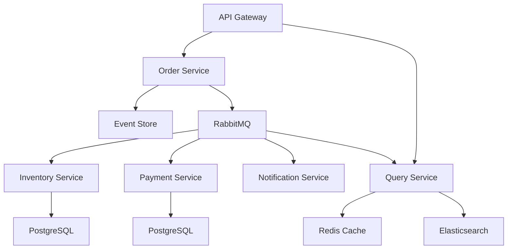

# Project 08: Event-Driven Order Processing System

## 🎯 Project Overview

Build a sophisticated event-driven order processing system using CQRS, Event Sourcing, and message queues. This advanced project demonstrates microservices architecture patterns, distributed systems design, and asynchronous communication.

## 🏆 Learning Objectives

- Implement CQRS (Command Query Responsibility Segregation) pattern
- Build event sourcing architecture
- Use message queues (RabbitMQ) for async communication
- Design microservices with domain-driven design
- Implement saga pattern for distributed transactions
- Handle eventual consistency
- Build resilient, scalable systems
- Monitor and trace distributed operations

## 📋 System Architecture

### Microservices

1. **Order Service** - Order management and command handling
2. **Inventory Service** - Stock management
3. **Payment Service** - Payment processing
4. **Notification Service** - Email/SMS notifications
5. **Query Service** - Read model for queries

### Infrastructure Components

- **Event Store** - Store all domain events
- **Message Bus** - RabbitMQ for async messaging
- **Redis** - Caching and query model
- **PostgreSQL** - Write models
- **Elasticsearch** - Search and analytics



## 🏗️ Project Structure

```
EventDrivenOrders/
├── src/
│   ├── Common/
│   │   ├── EventDrivenOrders.Domain/
│   │   ├── EventDrivenOrders.EventStore/
│   │   └── EventDrivenOrders.Messaging/
│   ├── Services/
│   │   ├── OrderService/
│   │   │   ├── OrderService.API/
│   │   │   ├── OrderService.Domain/
│   │   │   ├── OrderService.Application/
│   │   │   └── OrderService.Infrastructure/
│   │   ├── InventoryService/
│   │   ├── PaymentService/
│   │   ├── NotificationService/
│   │   └── QueryService/
│   └── Gateway/
│       └── ApiGateway/
├── tests/
│   ├── UnitTests/
│   ├── IntegrationTests/
│   └── E2ETests/
└── docker-compose.yml
```

## 📊 Domain Models

### Order Aggregate

```csharp
public class Order : AggregateRoot
{
    public Guid Id { get; private set; }
    public string CustomerEmail { get; private set; }
    public List<OrderItem> Items { get; private set; }
    public decimal Total { get; private set; }
    public OrderStatus Status { get; private set; }

    // Factory method
    public static Order Create(string customerEmail, List<OrderItem> items)
    {
        var order = new Order
        {
            Id = Guid.NewGuid(),
            CustomerEmail = customerEmail,
            Items = items,
            Total = items.Sum(i => i.Price * i.Quantity),
            Status = OrderStatus.Pending
        };

        // Raise domain event
        order.RaiseDomainEvent(new OrderCreatedEvent
        {
            OrderId = order.Id,
            CustomerEmail = order.CustomerEmail,
            Items = order.Items,
            Total = order.Total,
            OccurredAt = DateTime.UtcNow
        });

        return order;
    }

    public void ConfirmInventory()
    {
        if (Status != OrderStatus.Pending)
            throw new InvalidOperationException("Order is not pending");

        Status = OrderStatus.InventoryConfirmed;
        RaiseDomainEvent(new OrderInventoryConfirmedEvent
        {
            OrderId = Id,
            OccurredAt = DateTime.UtcNow
        });
    }

    public void ConfirmPayment(string transactionId)
    {
        if (Status != OrderStatus.InventoryConfirmed)
            throw new InvalidOperationException("Inventory not confirmed");

        Status = OrderStatus.PaymentConfirmed;
        RaiseDomainEvent(new OrderPaymentConfirmedEvent
        {
            OrderId = Id,
            TransactionId = transactionId,
            OccurredAt = DateTime.UtcNow
        });
    }

    public void Complete()
    {
        if (Status != OrderStatus.PaymentConfirmed)
            throw new InvalidOperationException("Payment not confirmed");

        Status = OrderStatus.Completed;
        RaiseDomainEvent(new OrderCompletedEvent
        {
            OrderId = Id,
            OccurredAt = DateTime.UtcNow
        });
    }

    public void Cancel(string reason)
    {
        if (Status == OrderStatus.Completed)
            throw new InvalidOperationException("Cannot cancel completed order");

        Status = OrderStatus.Cancelled;
        RaiseDomainEvent(new OrderCancelledEvent
        {
            OrderId = Id,
            Reason = reason,
            OccurredAt = DateTime.UtcNow
        });
    }
}

public enum OrderStatus
{
    Pending,
    InventoryConfirmed,
    PaymentConfirmed,
    Completed,
    Cancelled
}

public class OrderItem
{
    public Guid ProductId { get; set; }
    public string ProductName { get; set; }
    public decimal Price { get; set; }
    public int Quantity { get; set; }
}
```

## 🎯 CQRS Implementation

### Commands

```csharp
// Create Order Command
public record CreateOrderCommand : IRequest<Guid>
{
    public string CustomerEmail { get; init; }
    public List<OrderItemDto> Items { get; init; }
}

public class CreateOrderCommandHandler : IRequestHandler<CreateOrderCommand, Guid>
{
    private readonly IOrderRepository _repository;
    private readonly IEventBus _eventBus;

    public CreateOrderCommandHandler(
        IOrderRepository repository,
        IEventBus eventBus)
    {
        _repository = repository;
        _eventBus = eventBus;
    }

    public async Task<Guid> Handle(
        CreateOrderCommand command,
        CancellationToken cancellationToken)
    {
        // Create aggregate
        var items = command.Items.Select(i => new OrderItem
        {
            ProductId = i.ProductId,
            ProductName = i.ProductName,
            Price = i.Price,
            Quantity = i.Quantity
        }).ToList();

        var order = Order.Create(command.CustomerEmail, items);

        // Save to event store
        await _repository.SaveAsync(order);

        // Publish events
        foreach (var domainEvent in order.DomainEvents)
        {
            await _eventBus.PublishAsync(domainEvent);
        }

        return order.Id;
    }
}
```

### Queries

```csharp
// Get Order Query
public record GetOrderQuery : IRequest<OrderDto>
{
    public Guid OrderId { get; init; }
}

public class GetOrderQueryHandler : IRequestHandler<GetOrderQuery, OrderDto>
{
    private readonly IQueryService _queryService;

    public GetOrderQueryHandler(IQueryService queryService)
    {
        _queryService = queryService;
    }

    public async Task<OrderDto> Handle(
        GetOrderQuery query,
        CancellationToken cancellationToken)
    {
        // Read from read model (Redis/Elasticsearch)
        return await _queryService.GetOrderAsync(query.OrderId);
    }
}

// Read Model
public class OrderReadModel
{
    public Guid Id { get; set; }
    public string CustomerEmail { get; set; }
    public List<OrderItemReadModel> Items { get; set; }
    public decimal Total { get; set; }
    public string Status { get; set; }
    public DateTime CreatedAt { get; set; }
    public DateTime? CompletedAt { get; set; }
}
```

## 📬 Event Sourcing

### Event Store

```csharp
public interface IEventStore
{
    Task SaveEventsAsync(Guid aggregateId, IEnumerable<DomainEvent> events, int expectedVersion);
    Task<List<DomainEvent>> GetEventsAsync(Guid aggregateId);
}

public class PostgresEventStore : IEventStore
{
    private readonly AppDbContext _context;

    public async Task SaveEventsAsync(
        Guid aggregateId,
        IEnumerable<DomainEvent> events,
        int expectedVersion)
    {
        var currentVersion = await GetCurrentVersionAsync(aggregateId);

        if (currentVersion != expectedVersion)
        {
            throw new ConcurrencyException(
                $"Aggregate {aggregateId} has been modified");
        }

        foreach (var @event in events)
        {
            var eventData = new EventData
            {
                AggregateId = aggregateId,
                EventType = @event.GetType().AssemblyQualifiedName,
                Data = JsonSerializer.Serialize(@event),
                Version = ++currentVersion,
                OccurredAt = @event.OccurredAt
            };

            _context.Events.Add(eventData);
        }

        await _context.SaveChangesAsync();
    }

    public async Task<List<DomainEvent>> GetEventsAsync(Guid aggregateId)
    {
        var events = await _context.Events
            .Where(e => e.AggregateId == aggregateId)
            .OrderBy(e => e.Version)
            .ToListAsync();

        return events.Select(e =>
        {
            var type = Type.GetType(e.EventType);
            return JsonSerializer.Deserialize(e.Data, type) as DomainEvent;
        }).ToList();
    }
}

// Rebuild aggregate from events
public class OrderRepository : IOrderRepository
{
    private readonly IEventStore _eventStore;

    public async Task<Order> GetByIdAsync(Guid id)
    {
        var events = await _eventStore.GetEventsAsync(id);

        if (!events.Any())
            return null;

        var order = new Order();
        order.LoadFromHistory(events);
        return order;
    }

    public async Task SaveAsync(Order order)
    {
        await _eventStore.SaveEventsAsync(
            order.Id,
            order.DomainEvents,
            order.Version);
    }
}
```

## 🚌 Message Bus (RabbitMQ)

### Event Publisher

```csharp
public interface IEventBus
{
    Task PublishAsync<T>(T @event) where T : DomainEvent;
}

public class RabbitMqEventBus : IEventBus
{
    private readonly IConnection _connection;
    private readonly IModel _channel;

    public RabbitMqEventBus(IConfiguration configuration)
    {
        var factory = new ConnectionFactory
        {
            HostName = configuration["RabbitMq:Host"],
            Port = int.Parse(configuration["RabbitMq:Port"]),
            UserName = configuration["RabbitMq:Username"],
            Password = configuration["RabbitMq:Password"]
        };

        _connection = factory.CreateConnection();
        _channel = _connection.CreateModel();

        DeclareExchanges();
    }

    public async Task PublishAsync<T>(T @event) where T : DomainEvent
    {
        var exchangeName = GetExchangeName<T>();
        var message = JsonSerializer.Serialize(@event);
        var body = Encoding.UTF8.GetBytes(message);

        var properties = _channel.CreateBasicProperties();
        properties.Persistent = true;
        properties.MessageId = Guid.NewGuid().ToString();
        properties.Timestamp = new AmqpTimestamp(
            DateTimeOffset.UtcNow.ToUnixTimeSeconds());

        _channel.BasicPublish(
            exchange: exchangeName,
            routingKey: string.Empty,
            basicProperties: properties,
            body: body);

        await Task.CompletedTask;
    }

    private void DeclareExchanges()
    {
        _channel.ExchangeDeclare("order.events", ExchangeType.Fanout, durable: true);
        _channel.ExchangeDeclare("inventory.events", ExchangeType.Fanout, durable: true);
        _channel.ExchangeDeclare("payment.events", ExchangeType.Fanout, durable: true);
    }

    private string GetExchangeName<T>()
    {
        var eventType = typeof(T).Name;
        return eventType.Contains("Order") ? "order.events" :
               eventType.Contains("Inventory") ? "inventory.events" :
               eventType.Contains("Payment") ? "payment.events" :
               throw new ArgumentException($"Unknown event type: {eventType}");
    }
}
```

### Event Consumer

```csharp
public class OrderEventConsumer : BackgroundService
{
    private readonly IConnection _connection;
    private readonly IModel _channel;
    private readonly IServiceProvider _serviceProvider;

    protected override async Task ExecuteAsync(CancellationToken stoppingToken)
    {
        var consumer = new EventingBasicConsumer(_channel);

        consumer.Received += async (model, ea) =>
        {
            var body = ea.Body.ToArray();
            var message = Encoding.UTF8.GetString(body);

            try
            {
                using var scope = _serviceProvider.CreateScope();
                var handler = scope.ServiceProvider.GetRequiredService<IEventHandler>();

                await handler.HandleAsync(message);

                _channel.BasicAck(ea.DeliveryTag, multiple: false);
            }
            catch (Exception ex)
            {
                // Log error
                _channel.BasicNack(ea.DeliveryTag, multiple: false, requeue: true);
            }
        };

        _channel.BasicConsume(
            queue: "order.events.queue",
            autoAck: false,
            consumer: consumer);

        await Task.CompletedTask;
    }
}
```

## 🔄 Saga Pattern

### Order Processing Saga

```csharp
public class OrderProcessingSaga
{
    private readonly IEventBus _eventBus;
    private readonly IOrderRepository _orderRepository;

    // Orchestrate order processing
    public async Task HandleOrderCreatedAsync(OrderCreatedEvent @event)
    {
        // Step 1: Reserve inventory
        await _eventBus.PublishAsync(new ReserveInventoryCommand
        {
            OrderId = @event.OrderId,
            Items = @event.Items
        });
    }

    public async Task HandleInventoryReservedAsync(InventoryReservedEvent @event)
    {
        // Update order
        var order = await _orderRepository.GetByIdAsync(@event.OrderId);
        order.ConfirmInventory();
        await _orderRepository.SaveAsync(order);

        // Step 2: Process payment
        var orderTotal = order.Total;
        await _eventBus.PublishAsync(new ProcessPaymentCommand
        {
            OrderId = @event.OrderId,
            Amount = orderTotal
        });
    }

    public async Task HandlePaymentProcessedAsync(PaymentProcessedEvent @event)
    {
        // Update order
        var order = await _orderRepository.GetByIdAsync(@event.OrderId);
        order.ConfirmPayment(@event.TransactionId);
        await _orderRepository.SaveAsync(order);

        // Step 3: Send notification
        await _eventBus.PublishAsync(new SendOrderConfirmationCommand
        {
            OrderId = @event.OrderId
        });
    }

    // Handle failures
    public async Task HandleInventoryReservationFailedAsync(
        InventoryReservationFailedEvent @event)
    {
        // Cancel order
        var order = await _orderRepository.GetByIdAsync(@event.OrderId);
        order.Cancel("Inventory not available");
        await _orderRepository.SaveAsync(order);

        // Send notification
        await _eventBus.PublishAsync(new SendOrderCancellationCommand
        {
            OrderId = @event.OrderId,
            Reason = "Items out of stock"
        });
    }

    public async Task HandlePaymentFailedAsync(PaymentFailedEvent @event)
    {
        // Release inventory
        await _eventBus.PublishAsync(new ReleaseInventoryCommand
        {
            OrderId = @event.OrderId
        });

        // Cancel order
        var order = await _orderRepository.GetByIdAsync(@event.OrderId);
        order.Cancel("Payment failed");
        await _orderRepository.SaveAsync(order);
    }
}
```

## 🐳 Docker Compose

```yaml
version: '3.8'

services:
  postgres:
    image: postgres:16
    environment:
      POSTGRES_PASSWORD: password
    ports:
      - "5432:5432"
    volumes:
      - postgres_data:/var/lib/postgresql/data

  rabbitmq:
    image: rabbitmq:3-management
    ports:
      - "5672:5672"
      - "15672:15672"
    environment:
      RABBITMQ_DEFAULT_USER: admin
      RABBITMQ_DEFAULT_PASS: password

  redis:
    image: redis:7-alpine
    ports:
      - "6379:6379"

  elasticsearch:
    image: elasticsearch:8.11.0
    environment:
      - discovery.type=single-node
      - xpack.security.enabled=false
    ports:
      - "9200:9200"

  order-service:
    build: ./src/Services/OrderService
    ports:
      - "5001:80"
    depends_on:
      - postgres
      - rabbitmq
    environment:
      - ConnectionStrings__DefaultConnection=Host=postgres;Database=orders;Username=postgres;Password=password
      - RabbitMq__Host=rabbitmq

  inventory-service:
    build: ./src/Services/InventoryService
    ports:
      - "5002:80"
    depends_on:
      - postgres
      - rabbitmq

  payment-service:
    build: ./src/Services/PaymentService
    ports:
      - "5003:80"
    depends_on:
      - postgres
      - rabbitmq

  query-service:
    build: ./src/Services/QueryService
    ports:
      - "5004:80"
    depends_on:
      - redis
      - elasticsearch
      - rabbitmq

volumes:
  postgres_data:
```

## ✅ Acceptance Criteria

- ✅ CQRS pattern implemented correctly
- ✅ Event sourcing for order aggregate
- ✅ Distributed transactions with saga pattern
- ✅ Async communication via RabbitMQ
- ✅ Read model in Redis/Elasticsearch
- ✅ Eventual consistency handled properly
- ✅ Idempotent event handlers
- ✅ Compensating transactions for failures
- ✅ Comprehensive logging and tracing
- ✅ Integration tests for entire flow

## 🎯 Milestones

### Week 1: Foundation
- Domain models and events
- Event store implementation
- Order service with CQRS

### Week 2: Integration
- RabbitMQ integration
- Inventory and payment services
- Saga orchestration

### Week 3: Query & Polish
- Query service with read models
- Monitoring and observability
- End-to-end testing

## ⏱️ Estimated Time

- **Planning**: 8-10 hours
- **Implementation**: 40-50 hours
- **Testing**: 10-15 hours
- **Total**: 58-75 hours over 4 weeks

## 📚 Key Technologies

- **ASP.NET Core 10** - Web APIs
- **MediatR** - CQRS implementation
- **Entity Framework Core** - Data access
- **RabbitMQ** - Message broker
- **Redis** - Caching
- **Elasticsearch** - Search
- **Docker** - Containerization
- **xUnit** - Testing

---

**This is an advanced project requiring solid understanding of:**
- Distributed systems
- Event-driven architecture
- Domain-driven design
- Microservices patterns

**Prerequisites:** Complete Modules 1-10

Good luck building your event-driven masterpiece! 🚀
