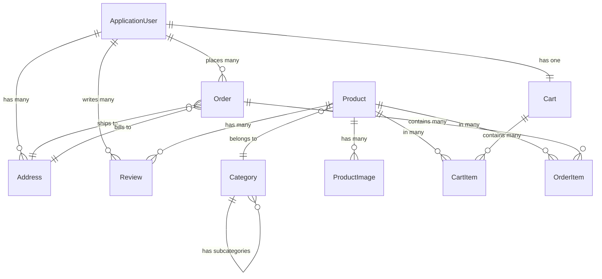

# Project 05: E-Commerce REST API

## 🎯 Project Overview

Build a complete e-commerce REST API with authentication, product management, shopping cart, and order processing. This project integrates:

- **ASP.NET Core Web API**: RESTful endpoints
- **Entity Framework Core**: Database access with Code First
- **JWT Authentication**: Secure user authentication
- **Authorization**: Role-based and policy-based access control
- **Repository Pattern**: Clean data access layer
- **Unit of Work**: Transaction management
- **DTOs & AutoMapper**: Separate API models from domain models
- **FluentValidation**: Complex input validation
- **Swagger/OpenAPI**: API documentation
- **Error Handling**: Global exception handling
- **Logging**: Structured logging with Serilog

## 📋 Functional Requirements

### Core Features

#### 1. User Management
- **Registration** with email confirmation
- **Login** with JWT token generation
- **Password reset** via email
- **User profiles** with address management
- **Roles**: Customer, Admin

#### 2. Product Catalog
- **CRUD operations** for products (Admin only)
- **Categories** and subcategories
- **Product search** with filters (price range, category, rating)
- **Pagination** and sorting
- **Product images** (URLs)
- **Inventory management**
- **Product reviews** and ratings

#### 3. Shopping Cart
- **Add/remove/update** cart items
- **View cart** with calculated totals
- **Cart persistence** (saved to database)
- **Apply discount codes**
- **Calculate shipping**

#### 4. Order Management
- **Checkout** with order creation
- **Order history** for customers
- **Order details** view
- **Order status** tracking (Pending, Processing, Shipped, Delivered, Cancelled)
- **Admin order management** (view all orders, update status)

#### 5. Payment Processing
- **Payment methods**: Credit Card, PayPal (mock implementation)
- **Payment validation**
- **Order confirmation emails**

## 🗄️ Database Schema

### Entities

```csharp
// User (from Identity)
public class ApplicationUser : IdentityUser
{
    public string FirstName { get; set; } = string.Empty;
    public string LastName { get; set; } = string.Empty;
    public DateTime CreatedAt { get; set; }

    // Navigation properties
    public List<Address> Addresses { get; set; } = new();
    public Cart? Cart { get; set; }
    public List<Order> Orders { get; set; } = new();
    public List<Review> Reviews { get; set; } = new();
}

// Product
public class Product
{
    public int Id { get; set; }
    public string Name { get; set; } = string.Empty;
    public string Description { get; set; } = string.Empty;
    public string SKU { get; set; } = string.Empty;
    public decimal Price { get; set; }
    public decimal? CompareAtPrice { get; set; } // Original price for sales
    public int StockQuantity { get; set; }
    public bool IsActive { get; set; }
    public DateTime CreatedAt { get; set; }
    public DateTime UpdatedAt { get; set; }

    // Foreign keys
    public int CategoryId { get; set; }
    public Category Category { get; set; } = null!;

    // Navigation properties
    public List<ProductImage> Images { get; set; } = new();
    public List<Review> Reviews { get; set; } = new();

    // Computed properties
    public decimal AverageRating => Reviews.Any() ? Reviews.Average(r => r.Rating) : 0;
    public int ReviewCount => Reviews.Count;
}

// Category
public class Category
{
    public int Id { get; set; }
    public string Name { get; set; } = string.Empty;
    public string Description { get; set; } = string.Empty;
    public string Slug { get; set; } = string.Empty;
    public int? ParentCategoryId { get; set; }

    // Navigation properties
    public Category? ParentCategory { get; set; }
    public List<Category> SubCategories { get; set; } = new();
    public List<Product> Products { get; set; } = new();
}

// ProductImage
public class ProductImage
{
    public int Id { get; set; }
    public string Url { get; set; } = string.Empty;
    public string AltText { get; set; } = string.Empty;
    public bool IsPrimary { get; set; }
    public int DisplayOrder { get; set; }

    // Foreign key
    public int ProductId { get; set; }
    public Product Product { get; set; } = null!;
}

// Cart
public class Cart
{
    public int Id { get; set; }
    public string UserId { get; set; } = string.Empty;
    public DateTime CreatedAt { get; set; }
    public DateTime UpdatedAt { get; set; }

    // Navigation properties
    public ApplicationUser User { get; set; } = null!;
    public List<CartItem> Items { get; set; } = new();

    // Computed properties
    public decimal Subtotal => Items.Sum(i => i.Quantity * i.Price);
    public int TotalItems => Items.Sum(i => i.Quantity);
}

// CartItem
public class CartItem
{
    public int Id { get; set; }
    public int Quantity { get; set; }
    public decimal Price { get; set; } // Snapshot price at time added

    // Foreign keys
    public int CartId { get; set; }
    public Cart Cart { get; set; } = null!;

    public int ProductId { get; set; }
    public Product Product { get; set; } = null!;
}

// Order
public class Order
{
    public int Id { get; set; }
    public string OrderNumber { get; set; } = string.Empty; // e.g., ORD-2025-001234
    public OrderStatus Status { get; set; }
    public decimal Subtotal { get; set; }
    public decimal ShippingCost { get; set; }
    public decimal Tax { get; set; }
    public decimal Discount { get; set; }
    public decimal Total { get; set; }
    public string? DiscountCode { get; set; }
    public PaymentMethod PaymentMethod { get; set; }
    public string? PaymentTransactionId { get; set; }
    public DateTime CreatedAt { get; set; }
    public DateTime? ShippedAt { get; set; }
    public DateTime? DeliveredAt { get; set; }

    // Foreign keys
    public string UserId { get; set; } = string.Empty;
    public ApplicationUser User { get; set; } = null!;

    public int ShippingAddressId { get; set; }
    public Address ShippingAddress { get; set; } = null!;

    public int BillingAddressId { get; set; }
    public Address BillingAddress { get; set; } = null!;

    // Navigation properties
    public List<OrderItem> Items { get; set; } = new();
}

// OrderItem
public class OrderItem
{
    public int Id { get; set; }
    public string ProductName { get; set; } = string.Empty; // Snapshot
    public string ProductSKU { get; set; } = string.Empty;  // Snapshot
    public int Quantity { get; set; }
    public decimal UnitPrice { get; set; } // Snapshot price

    // Foreign keys
    public int OrderId { get; set; }
    public Order Order { get; set; } = null!;

    public int ProductId { get; set; }
    public Product Product { get; set; } = null!;

    // Computed
    public decimal LineTotal => Quantity * UnitPrice;
}

// Address
public class Address
{
    public int Id { get; set; }
    public string Street { get; set; } = string.Empty;
    public string City { get; set; } = string.Empty;
    public string State { get; set; } = string.Empty;
    public string ZipCode { get; set; } = string.Empty;
    public string Country { get; set; } = string.Empty;
    public bool IsDefault { get; set; }

    // Foreign key
    public string UserId { get; set; } = string.Empty;
    public ApplicationUser User { get; set; } = null!;
}

// Review
public class Review
{
    public int Id { get; set; }
    public int Rating { get; set; } // 1-5
    public string Title { get; set; } = string.Empty;
    public string Comment { get; set; } = string.Empty;
    public DateTime CreatedAt { get; set; }
    public bool IsVerifiedPurchase { get; set; }

    // Foreign keys
    public int ProductId { get; set; }
    public Product Product { get; set; } = null!;

    public string UserId { get; set; } = string.Empty;
    public ApplicationUser User { get; set; } = null!;
}

// Enums
public enum OrderStatus
{
    Pending = 1,
    PaymentReceived = 2,
    Processing = 3,
    Shipped = 4,
    Delivered = 5,
    Cancelled = 6,
    Refunded = 7
}

public enum PaymentMethod
{
    CreditCard = 1,
    PayPal = 2,
    BankTransfer = 3
}
```

### Entity Relationships Diagram



## 🏗️ Architecture

### Project Structure

```
ECommerceAPI/
├── ECommerceAPI.API/              # Web API layer
│   ├── Controllers/
│   ├── Middleware/
│   ├── Program.cs
│   └── appsettings.json
├── ECommerceAPI.Core/             # Domain layer
│   ├── Entities/
│   ├── Interfaces/
│   ├── Enums/
│   └── Exceptions/
├── ECommerceAPI.Application/      # Application layer
│   ├── DTOs/
│   ├── Services/
│   ├── Validators/
│   ├── Mappings/
│   └── Interfaces/
├── ECommerceAPI.Infrastructure/   # Infrastructure layer
│   ├── Data/
│   │   ├── ApplicationDbContext.cs
│   │   ├── Repositories/
│   │   └── UnitOfWork.cs
│   ├── Identity/
│   └── Services/
└── ECommerceAPI.Tests/            # Test projects
    ├── UnitTests/
    └── IntegrationTests/
```

### Layered Architecture

```
┌─────────────────────────────────────┐
│         API Layer                    │
│  (Controllers, Middleware)           │
└──────────────┬──────────────────────┘
               │
┌──────────────▼──────────────────────┐
│      Application Layer               │
│  (Services, DTOs, Validators)        │
└──────────────┬──────────────────────┘
               │
┌──────────────▼──────────────────────┐
│         Domain Layer                 │
│    (Entities, Interfaces)            │
└──────────────┬──────────────────────┘
               │
┌──────────────▼──────────────────────┐
│    Infrastructure Layer              │
│ (EF Core, Repositories, External)    │
└─────────────────────────────────────┘
```

## 📡 API Endpoints

### Authentication

```
POST   /api/auth/register              # Register new user
POST   /api/auth/login                 # Login and get JWT
POST   /api/auth/refresh-token         # Refresh JWT
POST   /api/auth/forgot-password       # Request password reset
POST   /api/auth/reset-password        # Reset password
GET    /api/auth/confirm-email         # Confirm email address
```

### Products

```
GET    /api/products                   # Get all products (with filters)
GET    /api/products/{id}              # Get product by ID
POST   /api/products                   # Create product (Admin)
PUT    /api/products/{id}              # Update product (Admin)
DELETE /api/products/{id}              # Delete product (Admin)
GET    /api/products/{id}/reviews      # Get product reviews
POST   /api/products/{id}/reviews      # Add review (Authenticated)
GET    /api/products/search            # Search products
```

### Categories

```
GET    /api/categories                 # Get all categories
GET    /api/categories/{id}            # Get category by ID
GET    /api/categories/{id}/products   # Get products in category
POST   /api/categories                 # Create category (Admin)
PUT    /api/categories/{id}            # Update category (Admin)
DELETE /api/categories/{id}            # Delete category (Admin)
```

### Cart

```
GET    /api/cart                       # Get current user's cart
POST   /api/cart/items                 # Add item to cart
PUT    /api/cart/items/{id}            # Update cart item quantity
DELETE /api/cart/items/{id}            # Remove item from cart
DELETE /api/cart                       # Clear cart
POST   /api/cart/apply-discount        # Apply discount code
```

### Orders

```
GET    /api/orders                     # Get user's orders
GET    /api/orders/{id}                # Get order details
POST   /api/orders                     # Create order (checkout)
PUT    /api/orders/{id}/cancel         # Cancel order
GET    /api/orders/admin               # Get all orders (Admin)
PUT    /api/orders/{id}/status         # Update order status (Admin)
```

### Users

```
GET    /api/users/me                   # Get current user profile
PUT    /api/users/me                   # Update profile
GET    /api/users/me/addresses         # Get user addresses
POST   /api/users/me/addresses         # Add address
PUT    /api/users/me/addresses/{id}    # Update address
DELETE /api/users/me/addresses/{id}    # Delete address
```

## 📝 Example Request/Response

### GET /api/products?category=electronics&minPrice=100&maxPrice=1000&page=1&pageSize=10

**Response:**
```json
{
  "data": [
    {
      "id": 1,
      "name": "Wireless Headphones",
      "description": "Premium noise-cancelling headphones",
      "sku": "ELEC-HEAD-001",
      "price": 299.99,
      "compareAtPrice": 399.99,
      "discount": 25,
      "stockQuantity": 50,
      "category": {
        "id": 5,
        "name": "Electronics",
        "slug": "electronics"
      },
      "images": [
        {
          "url": "https://example.com/images/headphones-1.jpg",
          "altText": "Wireless Headphones Front View",
          "isPrimary": true
        }
      ],
      "averageRating": 4.5,
      "reviewCount": 128
    }
  ],
  "pagination": {
    "page": 1,
    "pageSize": 10,
    "totalItems": 45,
    "totalPages": 5,
    "hasNext": true,
    "hasPrevious": false
  }
}
```

### POST /api/cart/items

**Request:**
```json
{
  "productId": 1,
  "quantity": 2
}
```

**Response:**
```json
{
  "id": 123,
  "items": [
    {
      "id": 456,
      "product": {
        "id": 1,
        "name": "Wireless Headphones",
        "price": 299.99,
        "imageUrl": "https://example.com/images/headphones-1.jpg"
      },
      "quantity": 2,
      "price": 299.99,
      "subtotal": 599.98
    }
  ],
  "subtotal": 599.98,
  "totalItems": 2
}
```

### POST /api/orders

**Request:**
```json
{
  "shippingAddressId": 5,
  "billingAddressId": 5,
  "paymentMethod": "CreditCard",
  "discountCode": "SAVE20"
}
```

**Response:**
```json
{
  "id": 789,
  "orderNumber": "ORD-2025-001234",
  "status": "Pending",
  "items": [
    {
      "productName": "Wireless Headphones",
      "productSKU": "ELEC-HEAD-001",
      "quantity": 2,
      "unitPrice": 299.99,
      "lineTotal": 599.98
    }
  ],
  "subtotal": 599.98,
  "shippingCost": 9.99,
  "tax": 54.00,
  "discount": 119.99,
  "total": 543.98,
  "createdAt": "2025-11-12T10:30:00Z"
}
```

## 💻 Key Implementation Details

### Repository Pattern

```csharp
public interface IRepository<T> where T : class
{
    Task<T?> GetByIdAsync(int id);
    Task<IEnumerable<T>> GetAllAsync();
    Task<IEnumerable<T>> FindAsync(Expression<Func<T, bool>> predicate);
    Task<T> AddAsync(T entity);
    void Update(T entity);
    void Remove(T entity);
}

public class Repository<T> : IRepository<T> where T : class
{
    protected readonly ApplicationDbContext _context;
    protected readonly DbSet<T> _dbSet;

    public Repository(ApplicationDbContext context)
    {
        _context = context;
        _dbSet = context.Set<T>();
    }

    public async Task<T?> GetByIdAsync(int id)
    {
        return await _dbSet.FindAsync(id);
    }

    public async Task<IEnumerable<T>> GetAllAsync()
    {
        return await _dbSet.ToListAsync();
    }

    public async Task<IEnumerable<T>> FindAsync(Expression<Func<T, bool>> predicate)
    {
        return await _dbSet.Where(predicate).ToListAsync();
    }

    public async Task<T> AddAsync(T entity)
    {
        await _dbSet.AddAsync(entity);
        return entity;
    }

    public void Update(T entity)
    {
        _dbSet.Update(entity);
    }

    public void Remove(T entity)
    {
        _dbSet.Remove(entity);
    }
}
```

### Unit of Work

```csharp
public interface IUnitOfWork : IDisposable
{
    IProductRepository Products { get; }
    ICategoryRepository Categories { get; }
    ICartRepository Carts { get; }
    IOrderRepository Orders { get; }
    IReviewRepository Reviews { get; }

    Task<int> SaveChangesAsync();
    Task BeginTransactionAsync();
    Task CommitTransactionAsync();
    Task RollbackTransactionAsync();
}

public class UnitOfWork : IUnitOfWork
{
    private readonly ApplicationDbContext _context;
    private IDbContextTransaction? _transaction;

    public IProductRepository Products { get; }
    public ICategoryRepository Categories { get; }
    public ICartRepository Carts { get; }
    public IOrderRepository Orders { get; }
    public IReviewRepository Reviews { get; }

    public UnitOfWork(ApplicationDbContext context)
    {
        _context = context;

        Products = new ProductRepository(context);
        Categories = new CategoryRepository(context);
        Carts = new CartRepository(context);
        Orders = new OrderRepository(context);
        Reviews = new ReviewRepository(context);
    }

    public async Task<int> SaveChangesAsync()
    {
        return await _context.SaveChangesAsync();
    }

    public async Task BeginTransactionAsync()
    {
        _transaction = await _context.Database.BeginTransactionAsync();
    }

    public async Task CommitTransactionAsync()
    {
        if (_transaction != null)
        {
            await _transaction.CommitAsync();
            await _transaction.DisposeAsync();
            _transaction = null;
        }
    }

    public async Task RollbackTransactionAsync()
    {
        if (_transaction != null)
        {
            await _transaction.RollbackAsync();
            await _transaction.DisposeAsync();
            _transaction = null;
        }
    }

    public void Dispose()
    {
        _transaction?.Dispose();
        _context.Dispose();
    }
}
```

### Service Layer

```csharp
public interface IProductService
{
    Task<PagedResult<ProductDto>> GetProductsAsync(ProductQueryParameters parameters);
    Task<ProductDto?> GetProductByIdAsync(int id);
    Task<ProductDto> CreateProductAsync(CreateProductDto dto);
    Task UpdateProductAsync(int id, UpdateProductDto dto);
    Task DeleteProductAsync(int id);
    Task<IEnumerable<ReviewDto>> GetProductReviewsAsync(int productId);
}

public class ProductService : IProductService
{
    private readonly IUnitOfWork _unitOfWork;
    private readonly IMapper _mapper;
    private readonly ILogger<ProductService> _logger;

    public ProductService(IUnitOfWork unitOfWork, IMapper mapper, ILogger<ProductService> logger)
    {
        _unitOfWork = unitOfWork;
        _mapper = mapper;
        _logger = logger;
    }

    public async Task<PagedResult<ProductDto>> GetProductsAsync(ProductQueryParameters parameters)
    {
        var query = _unitOfWork.Products.GetQueryable();

        // Apply filters
        if (parameters.CategoryId.HasValue)
        {
            query = query.Where(p => p.CategoryId == parameters.CategoryId.Value);
        }

        if (!string.IsNullOrEmpty(parameters.SearchTerm))
        {
            query = query.Where(p =>
                p.Name.Contains(parameters.SearchTerm) ||
                p.Description.Contains(parameters.SearchTerm));
        }

        if (parameters.MinPrice.HasValue)
        {
            query = query.Where(p => p.Price >= parameters.MinPrice.Value);
        }

        if (parameters.MaxPrice.HasValue)
        {
            query = query.Where(p => p.Price <= parameters.MaxPrice.Value);
        }

        // Total count before pagination
        var totalItems = await query.CountAsync();

        // Apply sorting
        query = parameters.SortBy?.ToLower() switch
        {
            "price" => parameters.SortDescending
                ? query.OrderByDescending(p => p.Price)
                : query.OrderBy(p => p.Price),
            "name" => parameters.SortDescending
                ? query.OrderByDescending(p => p.Name)
                : query.OrderBy(p => p.Name),
            "rating" => parameters.SortDescending
                ? query.OrderByDescending(p => p.Reviews.Average(r => r.Rating))
                : query.OrderBy(p => p.Reviews.Average(r => r.Rating)),
            _ => query.OrderBy(p => p.Id)
        };

        // Apply pagination
        var products = await query
            .Skip((parameters.Page - 1) * parameters.PageSize)
            .Take(parameters.PageSize)
            .Include(p => p.Category)
            .Include(p => p.Images)
            .Include(p => p.Reviews)
            .ToListAsync();

        var productDtos = _mapper.Map<IEnumerable<ProductDto>>(products);

        return new PagedResult<ProductDto>
        {
            Data = productDtos,
            Pagination = new PaginationMetadata
            {
                Page = parameters.Page,
                PageSize = parameters.PageSize,
                TotalItems = totalItems,
                TotalPages = (int)Math.Ceiling(totalItems / (double)parameters.PageSize)
            }
        };
    }

    // Other methods...
}
```

### FluentValidation

```csharp
public class CreateProductDtoValidator : AbstractValidator<CreateProductDto>
{
    public CreateProductDtoValidator()
    {
        RuleFor(x => x.Name)
            .NotEmpty().WithMessage("Product name is required")
            .MaximumLength(200).WithMessage("Product name cannot exceed 200 characters");

        RuleFor(x => x.Description)
            .NotEmpty().WithMessage("Description is required")
            .MaximumLength(5000).WithMessage("Description cannot exceed 5000 characters");

        RuleFor(x => x.SKU)
            .NotEmpty().WithMessage("SKU is required")
            .Matches(@"^[A-Z]{4}-[A-Z]{4}-\d{3}$")
            .WithMessage("SKU must be in format: XXXX-XXXX-000");

        RuleFor(x => x.Price)
            .GreaterThan(0).WithMessage("Price must be greater than 0")
            .LessThanOrEqualTo(1000000).WithMessage("Price cannot exceed $1,000,000");

        RuleFor(x => x.StockQuantity)
            .GreaterThanOrEqualTo(0).WithMessage("Stock quantity cannot be negative");

        RuleFor(x => x.CategoryId)
            .GreaterThan(0).WithMessage("Valid category is required");
    }
}

// Register in Program.cs
builder.Services.AddValidatorsFromAssemblyContaining<CreateProductDtoValidator>();
builder.Services.AddFluentValidationAutoValidation();
```

### AutoMapper Profiles

```csharp
public class MappingProfile : Profile
{
    public MappingProfile()
    {
        // Product mappings
        CreateMap<Product, ProductDto>()
            .ForMember(dest => dest.CategoryName, opt => opt.MapFrom(src => src.Category.Name))
            .ForMember(dest => dest.PrimaryImage, opt => opt.MapFrom(src =>
                src.Images.FirstOrDefault(i => i.IsPrimary)!.Url))
            .ForMember(dest => dest.Discount, opt => opt.MapFrom(src =>
                src.CompareAtPrice.HasValue
                    ? Math.Round((1 - src.Price / src.CompareAtPrice.Value) * 100, 0)
                    : 0));

        CreateMap<CreateProductDto, Product>()
            .ForMember(dest => dest.CreatedAt, opt => opt.MapFrom(_ => DateTime.UtcNow))
            .ForMember(dest => dest.UpdatedAt, opt => opt.MapFrom(_ => DateTime.UtcNow));

        CreateMap<UpdateProductDto, Product>()
            .ForMember(dest => dest.UpdatedAt, opt => opt.MapFrom(_ => DateTime.UtcNow));

        // Order mappings
        CreateMap<Order, OrderDto>()
            .ForMember(dest => dest.Items, opt => opt.MapFrom(src => src.Items));

        CreateMap<OrderItem, OrderItemDto>();

        CreateMap<CreateOrderDto, Order>()
            .ForMember(dest => dest.OrderNumber, opt => opt.MapFrom(_ => GenerateOrderNumber()))
            .ForMember(dest => dest.Status, opt => opt.MapFrom(_ => OrderStatus.Pending))
            .ForMember(dest => dest.CreatedAt, opt => opt.MapFrom(_ => DateTime.UtcNow));

        // Cart mappings
        CreateMap<Cart, CartDto>();
        CreateMap<CartItem, CartItemDto>();

        // Review mappings
        CreateMap<Review, ReviewDto>()
            .ForMember(dest => dest.UserName, opt => opt.MapFrom(src =>
                $"{src.User.FirstName} {src.User.LastName}"));

        CreateMap<CreateReviewDto, Review>()
            .ForMember(dest => dest.CreatedAt, opt => opt.MapFrom(_ => DateTime.UtcNow));
    }

    private string GenerateOrderNumber()
    {
        var timestamp = DateTime.UtcNow.ToString("yyyyMMddHHmmss");
        var random = new Random().Next(1000, 9999);
        return $"ORD-{timestamp}-{random}";
    }
}
```

## ✅ Acceptance Criteria

1. **All endpoints functional** with proper HTTP status codes
2. **JWT authentication** working correctly
3. **Authorization** enforced (roles and policies)
4. **Input validation** with clear error messages
5. **Pagination** implemented for list endpoints
6. **Filtering and sorting** working correctly
7. **Database transactions** for order creation
8. **Unit tests** for services (>70% coverage)
9. **Integration tests** for critical flows
10. **Swagger documentation** complete
11. **Error handling** consistent across all endpoints
12. **Logging** implemented for all operations

## 🎓 Learning Objectives

- **REST API design** best practices
- **Layered architecture** (API, Application, Domain, Infrastructure)
- **Repository and Unit of Work** patterns
- **DTOs and AutoMapper** for data transformation
- **FluentValidation** for complex validation
- **JWT authentication** implementation
- **Role and policy-based** authorization
- **Entity Framework Core** with complex relationships
- **LINQ queries** for filtering and sorting
- **Pagination** implementation
- **Error handling** and logging
- **Swagger/OpenAPI** documentation

## ⏱️ Estimated Time

- **Project setup & architecture**: 2-3 hours
- **Entity models & database**: 3-4 hours
- **Repository & Unit of Work**: 2-3 hours
- **Authentication & authorization**: 3-4 hours
- **Product management**: 4-5 hours
- **Cart functionality**: 3-4 hours
- **Order processing**: 4-5 hours
- **Testing**: 3-4 hours
- **Documentation & polish**: 2-3 hours
- **Total: ~30-40 hours**

## 🚀 Bonus Challenges

1. **Payment Gateway Integration**: Real Stripe integration
2. **Email Service**: SendGrid for order confirmations
3. **Image Upload**: Azure Blob Storage integration
4. **Caching**: Redis for product catalog
5. **Rate Limiting**: IP-based throttling
6. **Inventory Management**: Low stock alerts
7. **Wishlist**: Save products for later
8. **Advanced Search**: Elasticsearch integration
9. **Admin Dashboard**: Statistics and reports
10. **Export Orders**: Excel/PDF generation
11. **Internationalization**: Multi-language support
12. **Currency Conversion**: Multi-currency support
13. **Shipping Integration**: Real shipping API (FedEx, UPS)
14. **Product Recommendations**: AI-based suggestions
15. **GraphQL API**: Alternative to REST

---

**Ready to build?** This is a portfolio-worthy project that demonstrates full-stack API development skills!

**Estimated learning value**: ⭐⭐⭐⭐⭐ (Advanced intermediate to professional level)
